# AWS Site-to-Site VPN

Extend your on-premises networks to the cloud.

AWS Site-to-Site VPN is a **fully-managed service** that creates a **secure connection between your data center or branch office and your AWS resources using IP Security (IPSec) tunnels**.

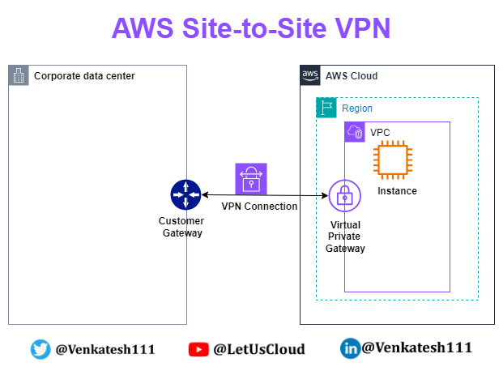

## Key Terminologies

- **VPN connection**: A secure connection between your on-premises equipment and your VPCs.
- **Customer gateway**: The VPN endpoint on the On-premise side of a Site-to-Site VPN connection. It is an AWS resource that provides information to AWS about your customer gateway device.
- **Customer gateway device**: A physical device or software application on the on-premises side of the Site-to-Site VPN connection.
- **Virtual private gateway**: The VPN endpoint on the AWS side of the Site-to-Site VPN connection, attachable to a single VPC.
- **VPN tunnel**: An encrypted link where data can pass from the customer network to or from AWS. Each VPN connection includes two VPN tunnels for high availability.
- **Transit gateway**: A transit hub that interconnects multiple VPCs and on-premises networks and serves as a VPN endpoint for the Amazon side of the Site-to-Site VPN connection.

## Setting up Site-to-Site VPN

### Pre-Requisites

- **On-premises IP address**: The public IP address of your customer gateway (your on-premises VPN device).
- **Routing type**: Decide whether to use static routing (you specify routes) or dynamic routing using Border Gateway Protocol (BGP).
- **AWS VPC**: A Virtual Private Cloud (VPC) set up in your AWS account where the VPN will be established.

### Configuration on AWS Side

1. Create a virtual private gateway.
2. Create a customer gateway.
3. Configure routing.
4. Update your security group.
5. Create a VPN connection.
6. Download the configuration file.

### Configuration on On-Premise Side

- Configure the customer gateway device.

## Site-to-Site VPN Hands-On

### What Are We Building?

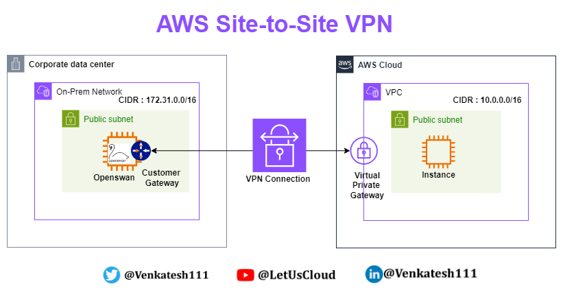

### Simulating On-premises Data Center

- **AWS Region**: Mumbai (ap-south-1)

#### VPC

- Create VPC with CIDR: 172.31.0.0/16.
- Create a public subnet: 172.31.0.0/20.
- Create a private subnet: 172.31.128.0/20.

    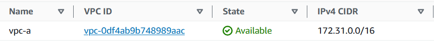
    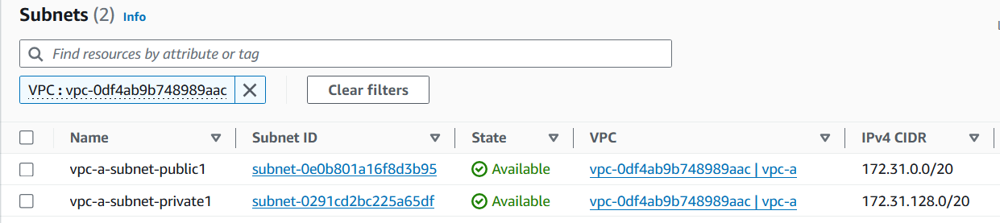

#### EC2

- Launch an Amazon Linux 2 instance in the public subnet of the custom VPC created.
- Stop source/destination checks for this EC2 instance.

    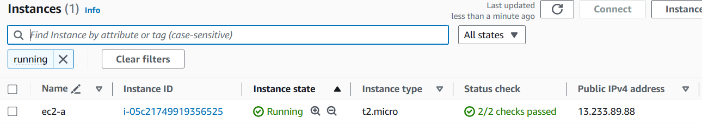
    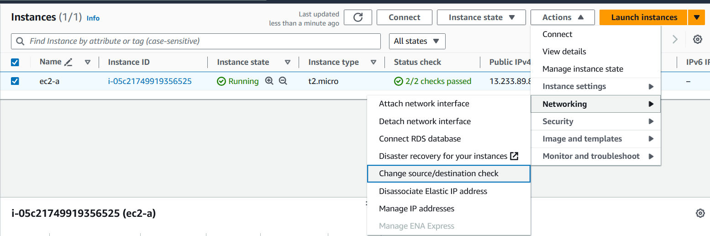

#### Security Group for EC2

- Allow SSH on port 22 from MyIP (your own IP).
- Allow ICMP from AWS VPC CIDR (10.0.0.0/16).
- Allow SSH on port 22 from AWS VPC CIDR (10.0.0.0/16).

    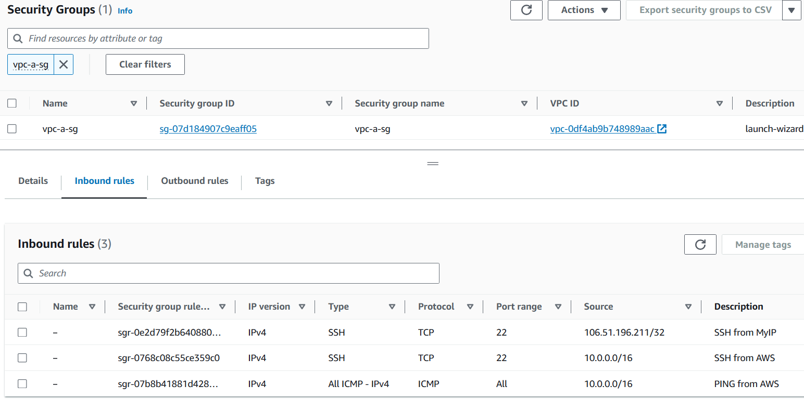

### Configuring OpenSwan

1. Connect to the EC2 instance.
2. Run the following commands to install OpenSwan:

    ```bash
    sudo su
    yum update -y
    yum install openswan -y
    ```

3. Edit the config file `/etc/sysctl.conf` to add the following lines:

    ```bash
    net.ipv4.ip_forward = 1
    net.ipv4.conf.all.accept_redirects = 0
    net.ipv4.conf.all.send_redirects = 0
    ```

4. Restart the network service:

    ```bash
    service network restart
    ```

5. We will configure the `/etc/ipsec.d/aws.conf` file after setting up the VPC on AWS.

### Configuration on AWS Side

- **AWS Region**: N.Virginia (us-east-1)

#### VPC

- Create a VPC with CIDR: 10.0.0.0/16.
- Create a public subnet: 10.0.0.0/20.
- Create a private subnet: 10.0.128.0/20.

    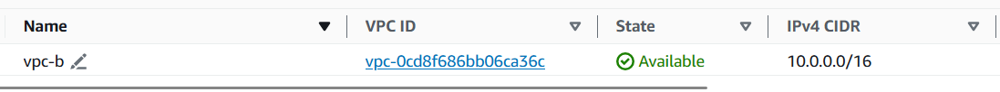
    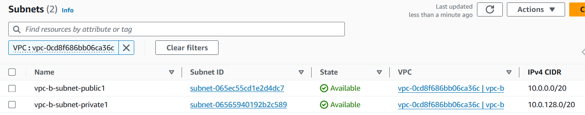

#### EC2

- Launch an Amazon Linux 2 instance in the public subnet of the custom VPC created.

    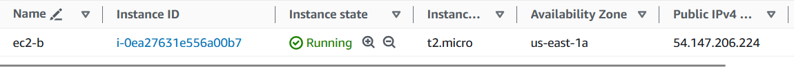

#### Security Group for EC2

- Allow SSH on port 22 from MyIP (your own IP).
- Allow SSH on port 22 from On-prem CIDR (172.31.0.0/16).
- Allow ICMP from On-prem CIDR (172.31.0.0/16).

    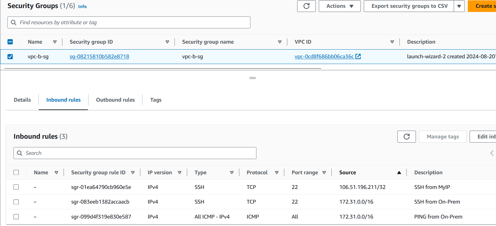

### Let's Do a Simple Ping Test

Both networks are not reachable.

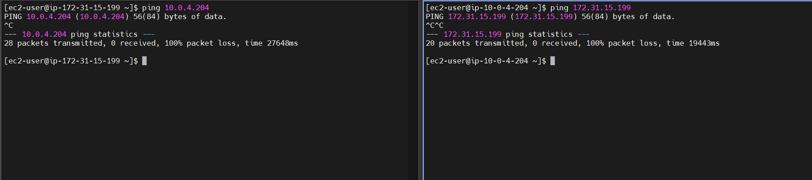

### Setting up Site-to-Site VPN Connection

1. Create a Virtual Private Gateway and attach it to the AWS VPC.
    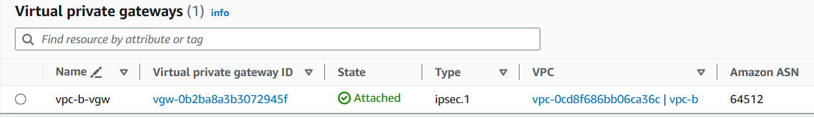
2. Create a Customer Gateway and attach it to the AWS VPC.
    - IP Address = Public IP of the VPN device, in our case, the public IP of the EC2 hosted in the Mumbai region.
    - IP Address = 13.233.89.88.
    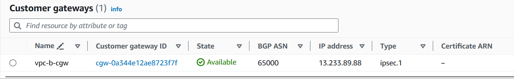
3. Create a site-to-site VPN connection.
    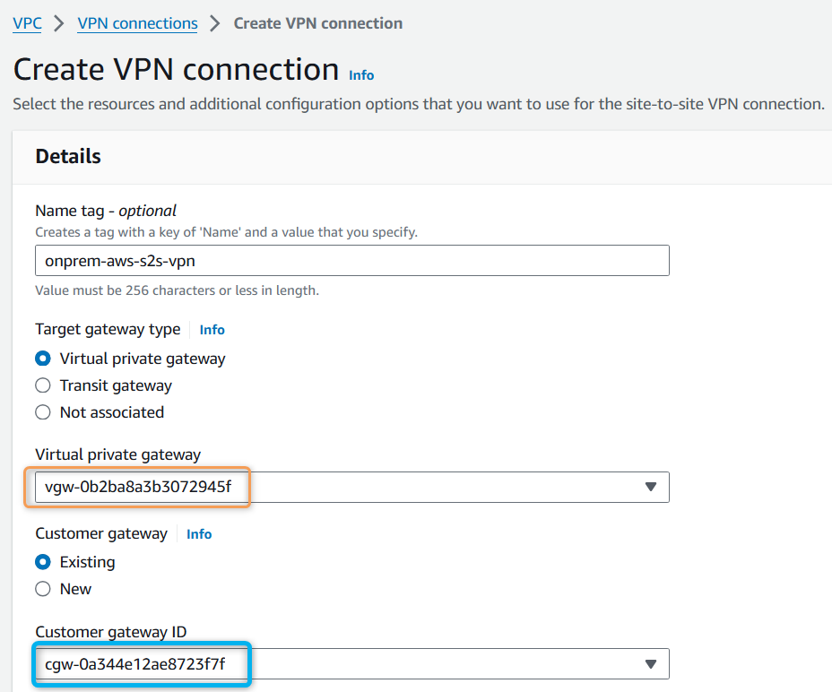
    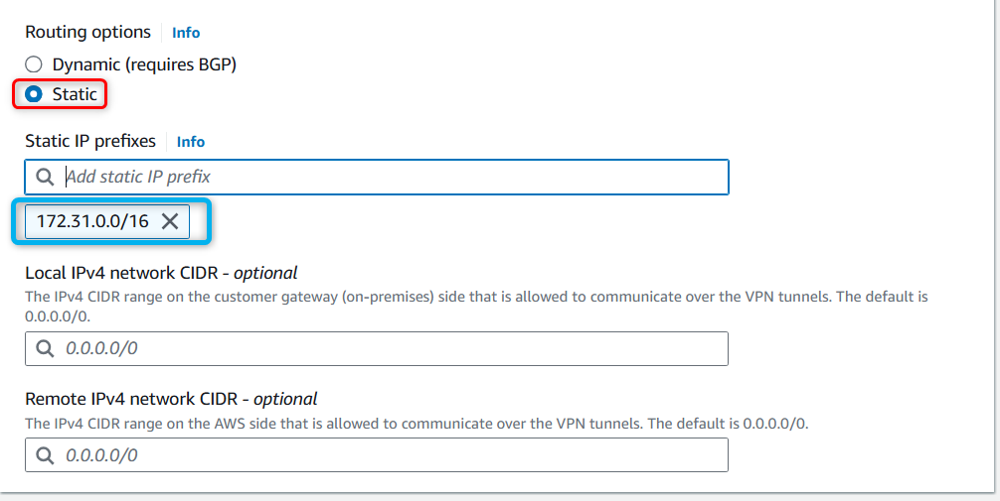
4. Wait for the site-to-site VPN to be provisioned.
    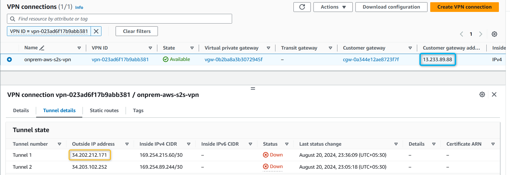

## 3. Configuration on On-Premise Side

- **Configure the Customer Gateway Device**
  
  Download the configuration file from the VPN console.

  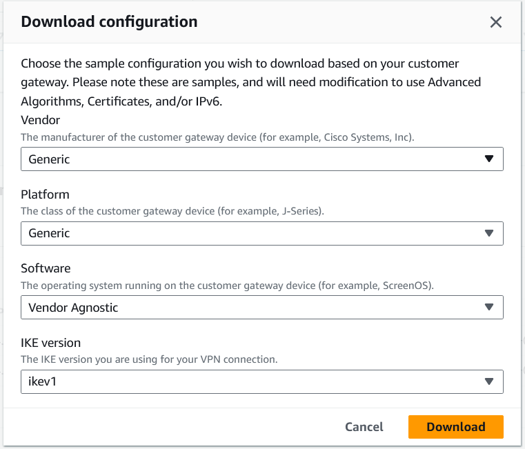

- **Create the config file `/etc/ipsec.d/aws.conf` and add the following lines:**

    ```
    conn Tunnel1
        authby=secret
        auto=start
        left=%defaultroute
        leftid=<Public IP of OpenSwan/CGW, pub IP of EC2 instance in Mumbai>
        right=<Public IP of VGW - Tunnel 1, from VPN tunnel details>
        type=tunnel
        ikelifetime=8h
        keylife=1h
        phase2alg=aes128-sha1;modp1024
        ike=aes128-sha1;modp1024
        keyingtries=%forever
        keyexchange=ike
        leftsubnet=<On-prem Network CIDR>
        rightsubnet=<AWS VPC CIDR>
        dpddelay=10
        dpdtimeout=30
        dpdaction=restart_by_peer
    ```

- **Example for current setup:**

    ```
    conn Tunnel1
        authby=secret
        auto=start
        left=%defaultroute
        leftid=13.233.89.88
        right=34.202.212.171
        type=tunnel
        ikelifetime=8h
        keylife=1h
        phase2alg=aes128-sha1;modp1024
        ike=aes128-sha1;modp1024
        keyingtries=%forever
        keyexchange=ike
        leftsubnet=172.31.0.0/16
        rightsubnet=10.0.0.0/16
        dpddelay=10
        dpdtimeout=30
        dpdaction=restart_by_peer
    ```

- **Add the shared secret in the file `/etc/ipsec.d/aws.secrets`:**

    - Find the shared key in the downloaded VPN configuration file as "Pre-Shared Key" under Tunnel 1 - IKE configuration section.
    
    - File format:
      
      ```
      <customer public ip> <aws vpg public ip>: PSK "<shared secret>"
      ```

    - Example:

      ```
      13.233.89.88 34.202.212.171: PSK "9d11R8zqe9xRWbALjD6I3O3qq6BYEGN7"
      ```

- **Configure the IPsec service to start on reboot:**

    ```
    chkconfig ipsec on
    ```

- **Start the IPsec service:**

    ```
    systemctl start ipsec
    systemctl status ipsec
    ```

    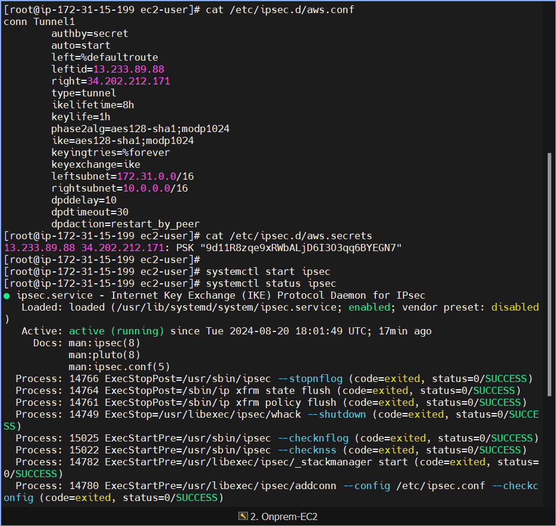

- **Enable Route Propagation:**

    On the **AWS VPC Public Subnets Route table**, enable route propagation.

    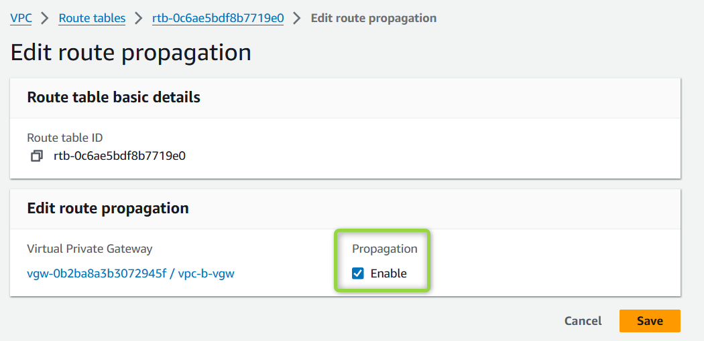

    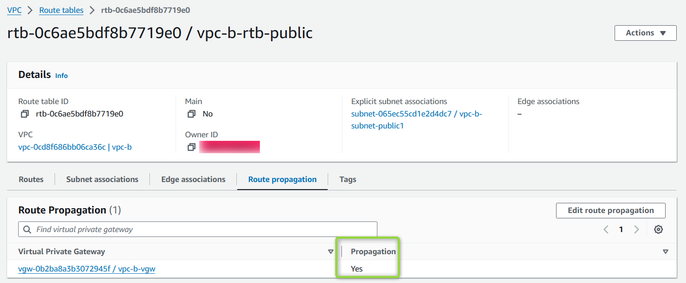

    After enabling, the routes should automatically be added to the route table.

    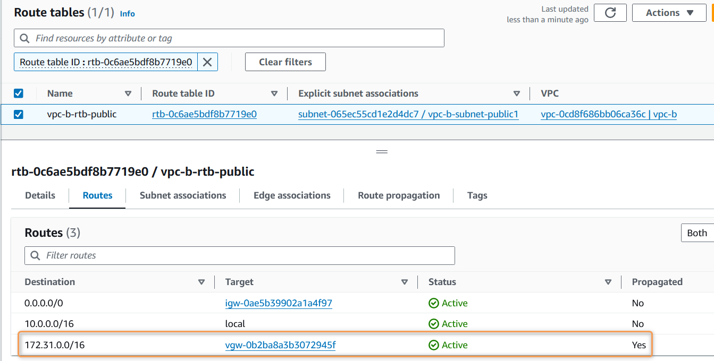

- **Validate VPN Connection:**

    You should now see Tunnel 1 as UP.

    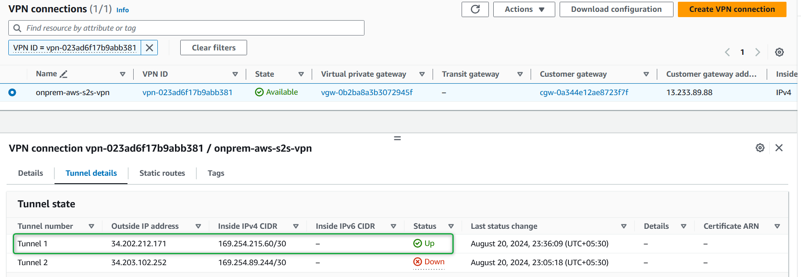

---

## Simple Ping Test

Both networks should now be able to ping each other.

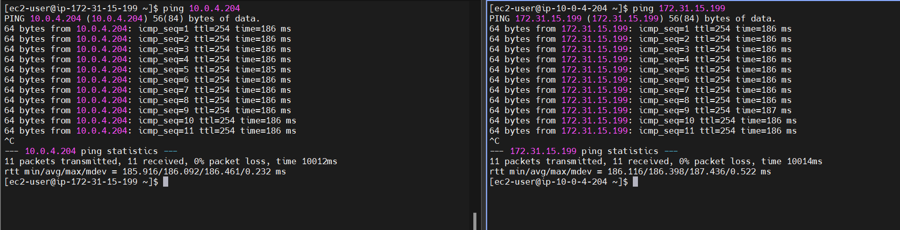

---

## SSH Test

Copy the PEM files to the EC2 instances (on-prem and AWS) and test SSH login.

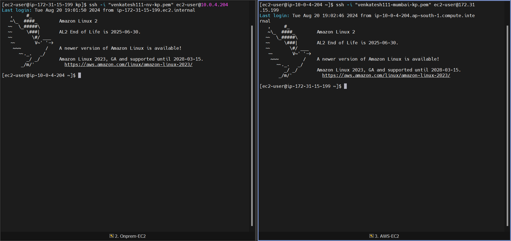

---

## Resource Cleanup

To avoid unnecessary charges, clean up the resources:

- Delete EC2 instances in both regions.
- Delete EC2 Security Groups.
- Delete key-pairs (if no longer required).
- Delete the VPN connection.
- Delete VGW and CGW.
- Delete VPCs in both regions.

---

## Pricing

- **Not Free Tier Eligible:**
  
  - You are charged for each **VPN connection-hour** that your VPN connection is provisioned and available.
  - Each partial hour is billed as a full hour.
  - Standard AWS data transfer charges apply for all data transferred via the VPN connection.
  - If you no longer need the VPN connection, terminate it to stop incurring charges.
  
- **Approximate cost for this hands-on lab: $0.40 (INR 40).**

  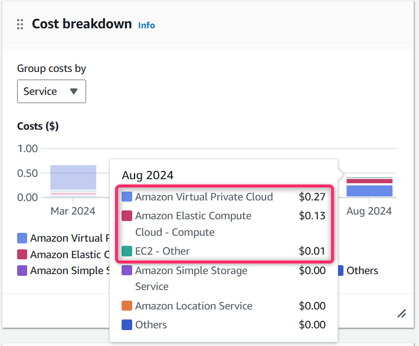

---

## References

- [AWS VPN Setup Guide](https://docs.aws.amazon.com/vpn/latest/s2svpn/SetUpVPNConnections.html)
- [OpenSwan EC2 Example](https://github.com/xelerance/Openswan/wiki/Amazon-ec2-example#remote-endpoint-config)
- [AWS Site-to-Site VPN](https://aws.amazon.com/vpn/site-to-site-vpn/)
- [AWS VPC Connectivity Options](https://docs.aws.amazon.com/whitepapers/latest/aws-vpc-connectivity-options/aws-site-to-site-vpn.html)
- [Simulating VPN Customer Gateways](https://aws.amazon.com/blogs/networking-and-content-delivery/simulating-site-to-site-vpn-customer-gateways-strongswan/)

