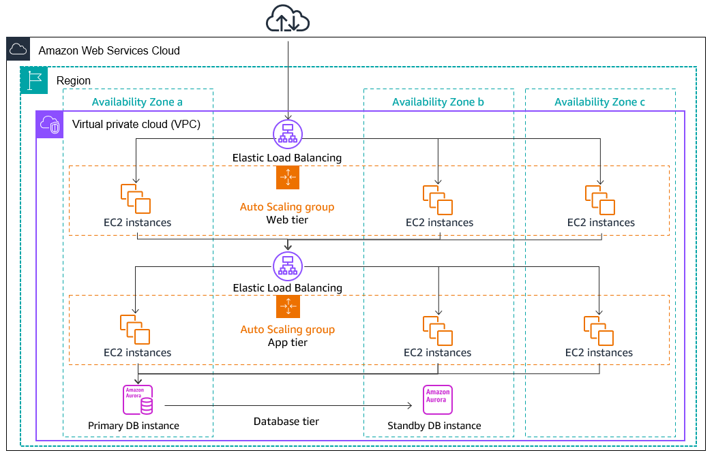
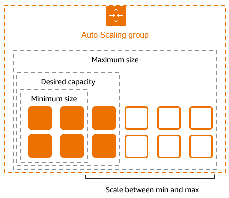
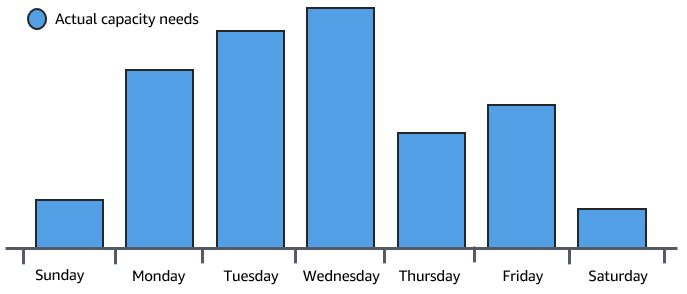
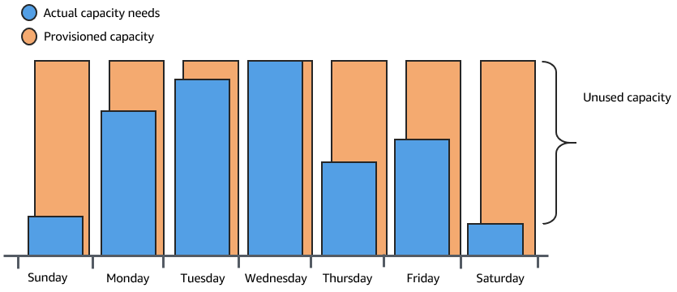
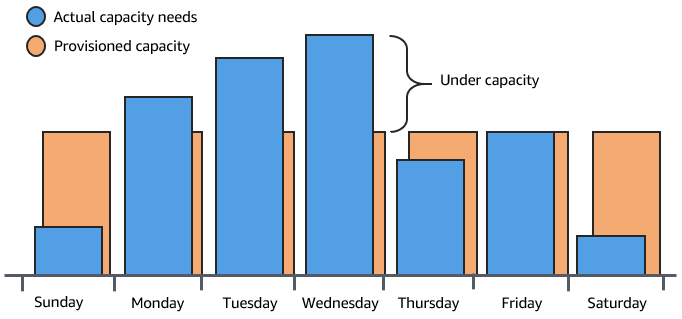
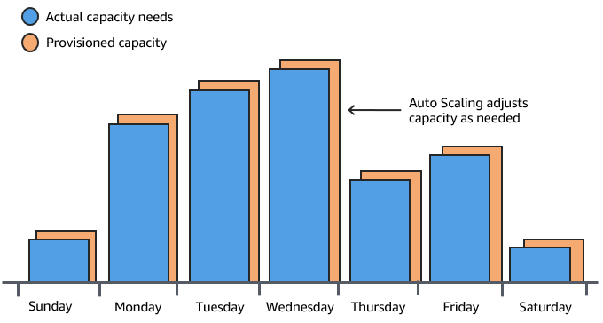
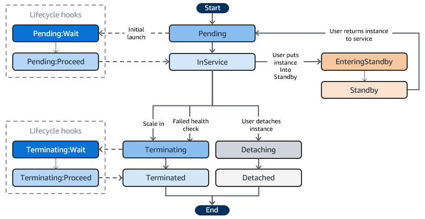
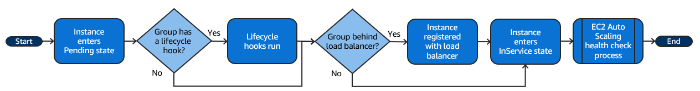
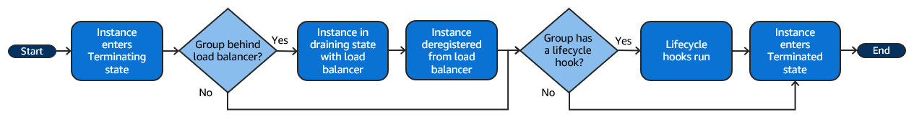

# Amazon EC2 Auto Scaling

<!--  -->

## Auto Scaling Groups (ASG)

- An Auto Scaling Group is a **collection of EC2 instances** that are treated as a **logical grouping** for the purposes of **automatic scaling and management**
- ASG helps you automatically manage the scaling(in/out) of EC2 instances to meet the dynamic workload of your applications
- ASG are ***`horizontal`*** (increase or decrease in EC2 instance Count) Scaling
- There are **no additional fees** with Amazon EC2 Auto Scaling, You only pay for the AWS resources (for example, EC2 instances, EBS volumes, and CloudWatch alarms) that you use.

### Advantages of ASG
    
- **Fault tolerance**
    - Amazon EC2 Auto Scaling **can detect when an instance is unhealthy, terminate it, and launch an instance to replace it**
    - You can also configure Amazon EC2 Auto Scaling to **use multiple Availability Zones**. If one Availability Zone becomes unavailable, Amazon EC2 Auto Scaling can launch instances in another one to compensate.

- **High Availability**
    - ASG helps ensure that your application **always has the right amount of capacity to handle the current traffic demand**

- **Better Cost Management**
    - Amazon EC2 Auto Scaling can dynamically increase and decrease capacity as needed. 
    - You pay for the EC2 instances you use, you save money by launching instances when they are needed and terminating them when they aren't.

## Understanding the Need for Amazon EC2 Auto Scaling

### Variable demand
- Consider a basic web application running on AWS.
- Purpose: Allows employees to search for conference rooms for meetings.
- Usage pattern:
    - Minimal usage at the beginning and end of the week.
    - Increased usage in the middle of the week as more employees schedule meetings.
- Graph below Displays the application’s capacity usage over the course of a week.

    <!--  -->

    

- **Traditional Capacity Planning Options:**

  - **Option 1: Add Enough Servers to Always Meet Demand**

    
    
    - Ensures sufficient capacity at all times.
    - Downside: Extra capacity remains unused on low-demand days, **increasing costs**.
    - Example: Inefficiency of buying more capacity than needed.

  - **Option 2: Handle Average Demand**

    

    - Less expensive as it avoids purchasing rarely used equipment.
    - Downside: Risk of **poor customer experience** when demand exceeds capacity.
    - Example: Poor customer experience due to insufficient capacity.

- **Amazon EC2 Auto Scaling:**

  - **Option 3: Dynamic Scaling**

    

    - Adds **new instances only when necessary**.
    - **Terminates instances when no longer needed**.
    - **Cost-effective**: Pay only for the instances used.
    - Provides the **best customer experience** while minimizing expenses.
    - Example: Adjusting capacity as needed with Amazon EC2 Auto Scaling.

### Balancing capacity across Availability Zones

- The following image shows an overview of multi-tier architecture deployed across three Availability Zones.

    

<!--  -->

- **Instance Distribution:**
  - Amazon EC2 Auto Scaling aims to **maintain equivalent numbers of instances in each enabled Availability Zone**.
  - It attempts to launch new instances in the Availability Zone with the fewest instances.
  - If multiple subnets are chosen for the Availability Zone, a subnet is selected at random.
  - If the launch attempt fails, it tries to launch instances in another Availability Zone until successful.
  - In cases where an Availability Zone becomes unhealthy or unavailable:
    - Instance distribution may become uneven across Availability Zones.
    - Upon recovery, Amazon EC2 Auto Scaling re-balances the Auto Scaling group.
    - It launches instances in the enabled Availability Zones with the fewest instances and terminates instances elsewhere.

## Amazon EC2 Auto Scaling instance lifecycle

<!--  -->

- **Start**: The beginning of the instance lifecycle.
- **Pending**: The instance is preparing to enter service.
  - **Pending:Wait**: A lifecycle hook where custom actions can be performed before the instance becomes active.
  - **Pending:Proceed**: The instance proceeds to the next state after the custom actions are completed.
- **InService**: The instance is now serving traffic.
  - **User puts instance into Standby**: The instance is manually moved to Standby state.
- **Standby**: The instance is not serving traffic but is still part of the Auto Scaling group.
  - **User returns instance to service**: The instance is manually moved back to InService state.
- **Terminating**: The instance is in the process of being shut down.
  - **Terminating:Wait**: A lifecycle hook where custom actions can be performed before the instance is terminated.
  - **Terminating:Proceed**: The instance proceeds to termination after the custom actions are completed.
- **Terminated**: The instance has been shut down and removed from service.
- **Detaching**: The instance is being detached from the Auto Scaling group.
- **Detached**: The instance has been successfully detached from the Auto Scaling group but not terminated.
- **End**: The lifecycle of the instance has concluded.

## ASG LifeCycle hooks

- Lifecycle hooks are like a ***`pause`*** button in Amazon EC2 Auto Scaling activity
- Lifecycle hooks let you **perform custom actions when instances are launched or terminated**
- Use cases:
    - Launch Hook: **Installing software**, **run scripts**,  or **configuring the instance** before an instance goes into service.
    - Terminate Hook: **Downloading logs**, **backup data**, or perform any **clean-up tasks** before an instance is terminated.

- **Scale-Out Event**:
  - Instances launch and start in **Pending** state.
  - With `autoscaling:EC2_INSTANCE_LAUNCHING` hook:
    - Move to **Pending:Wait** state.
    - Complete lifecycle action.
    - Move to **Pending:Proceed** state.
  - Fully configured instances attach to Auto Scaling group and enter **InService** state.

- **Scale-In Event**:
  - Instances terminate and detach from Auto Scaling group, entering **Terminating** state.
  - With `autoscaling:EC2_INSTANCE_TERMINATING` hook:
    - Move to **Terminating:Wait** state.
    - Complete lifecycle action.
    - Move to **Terminating:Proceed** state.
  - Fully terminated instances enter **Terminated** state.

## Scale out, `InService`, Scale in

### Scale out

- **Scale-Out Events**: Direct Auto Scaling group to launch and attach EC2 instances.
  - **Manual Increase**: Manually increase the size of the group.
  - **Scaling Policy**: Automatically increase the size based on demand.
  - **Scheduled Scaling**: Increase the size at a specific time.

- **Scale-Out Process**:
  - Auto Scaling group launches required EC2 instances using the launch template.
  - Instances start in Pending state.
  - **Lifecycle Hook**: Perform custom actions if added.
  - Instances fully configured and pass Amazon EC2 health checks.
  - Instances attach to Auto Scaling group and enter `InService` state.
  - Counted against desired capacity of the Auto Scaling group.

- **Load Balancer Integration**:
  - If configured to receive traffic from an Elastic Load Balancing load balancer:
    - Auto Scaling automatically registers the instance with the load balancer.
    - Instance marked as `InService` after registration.

### Instances in Service, `InService` 

- Instances remain in the **`InService`** state until one of the following occurs:

    1. **Scale-In Event**: A scale-in event occurs, and Amazon EC2 Auto Scaling chooses to terminate this instance to reduce the size of the Auto Scaling group.
    2. **Standby State**: You put the instance into a Standby state.
    3. **Detach Instance**: You detach the instance from the Auto Scaling group.
    4. **Health Check Failure**: The instance fails a required number of health checks, so it is removed from the Auto Scaling group, terminated, and replaced.

### Scale in

- **Scale-In Events**
    - **Direct Auto Scaling Group**: Detach and terminate EC2 instances.
    - **Manual Decrease**: Manually reduce the group size.
    - **Scaling Policy**: Automatically reduce the group size based on demand.
    - **Scheduled Scaling**: Reduce the group size at a specific time.

- **Scale-In Process**
    - **Instance Termination**: Auto Scaling group terminates instances using its termination policy.
    - **Terminating State**: Instances enter the Terminating state and can't be put back into service.
    - **Lifecycle Hook**: Perform custom actions on terminating instances if added.
    - **Complete Termination**: Instances are fully terminated and enter the Terminated state.

- **Load Balancer Integration**
    - **De-registration**: If using an Elastic Load Balancing load balancer, Auto Scaling automatically de-registers terminating instances.
    - **Request Redirection**: New requests are redirected to other instances, while existing connections continue until the de-registration delay expires.

## Launch Templates

### Launch Templates Vs Launch Configuration

| Feature | Launch Template | Launch Configuration |
|---------|-----------------|----------------------|
| Introduction | Newer and more flexible | Older and less flexible |
| Modification | Can be modified after creation | Cannot be modified once created |
| Versioning | Supports versioning | Does not support versioning |
| Use Cases | EC2 instances, Spot Fleets, and ASGs | Only ASGs |
| Configuration Changes | Allows partial changes | Requires full configuration for changes |
| Instance Types | Supports multiple instance types | Limited to a single instance type |
| AMI and Instance Type | Can be specified at launch time | Must be specified when creating |
| AWS Recommendation | Recommended for new deployments | Legacy option |
| Flexibility | More flexible and versatile | Less flexible |
| Updates | Can be updated | Cannot be updated, must create new |

## References

- https://docs.aws.amazon.com/autoscaling/ec2/userguide/auto-scaling-benefits.html

