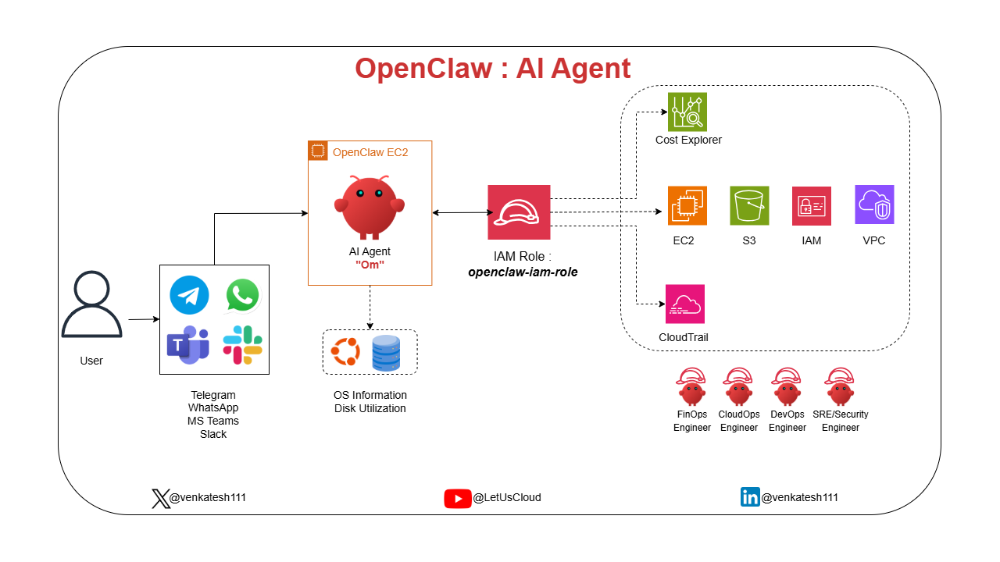
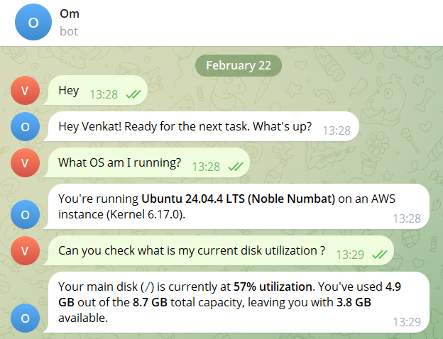
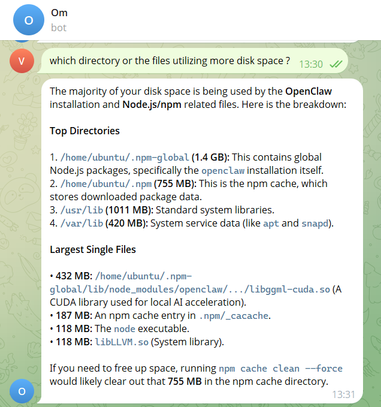
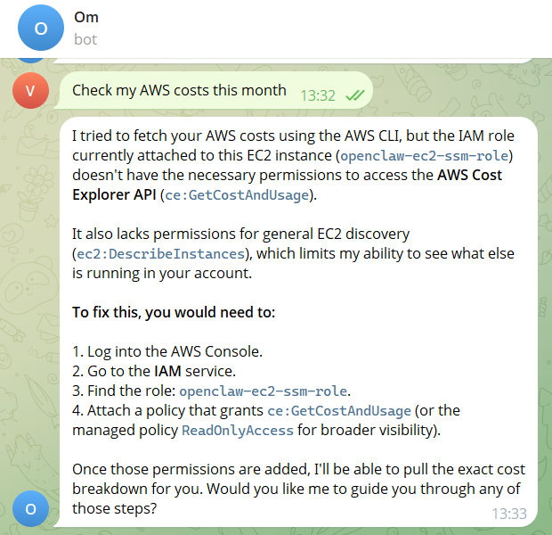
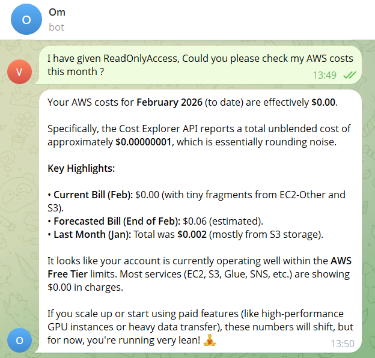
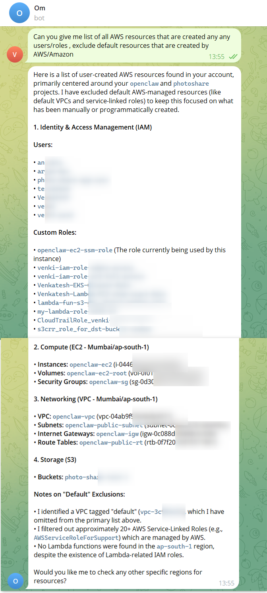
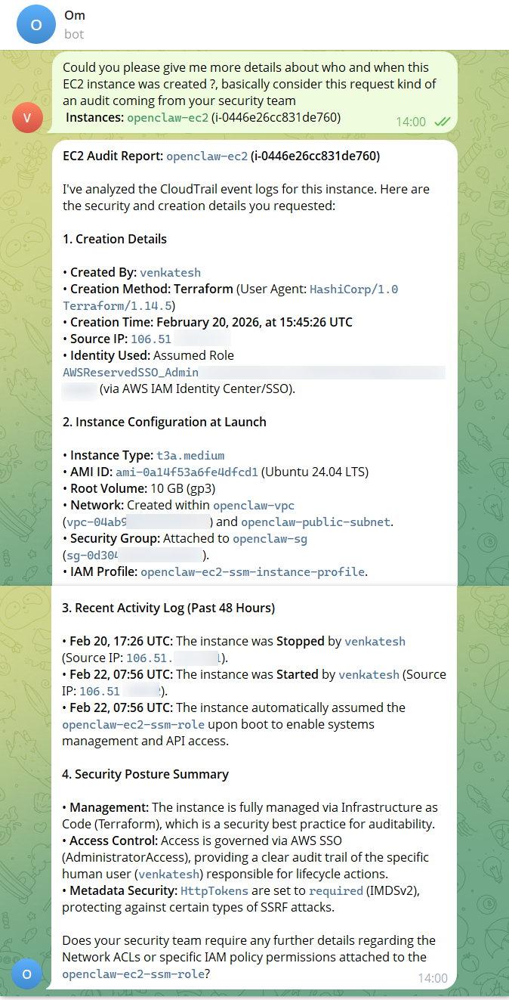

# I Gave an AI Agent Access to My AWS Account - Here's What It Found

## The Moment It Clicked

I asked my AI agent what OS it was running on.

It answered correctly, without me telling it anything.

That's when I stopped thinking of it as a chatbot and started thinking of it as something else entirely: an autonomous operator inside my cloud environment.

The agent is called Om. I built it using an open-source framework called OpenClaw, deployed on an EC2 instance in AWS. Instead of logging into consoles, running CLI commands, or digging through dashboards, I just talk to it. Through Telegram.

This post is a walkthrough of what I tested, what Om did, and more importantly, what it made me think about.

## What I Built and How It Works

Before the demo, a quick note on the architecture, because it matters for the security conversation later.

### OpenClaw AI Agent Architecture

Om runs on an EC2 instance in AWS. It can connect to messaging platforms like Telegram, WhatsApp, MS Teams, Slack, so you can interact with it from whichever platform your team already uses.

Because it runs on the EC2, it has direct access to local system state: OS details, disk usage, running processes. No external API call needed for that.

For AWS access, it authenticates via an IAM Role attached to the EC2 instance, `openclaw-iam-role`. No hardcoded credentials. No secrets in config files. Just IAM, the way it was designed to work.

Through that role, Om can reach: Cost Explorer, EC2, S3, IAM, VPC, CloudTrail and other AWS Resources.

That's the whole architecture. Simple, clean, and IAM-governed end to end.

Now, here's what happened when I put it to work.

## Test 1: System Awareness

**What I asked:** "What OS am I running?" / "What's my disk utilization?" / "Which directories are consuming the most space?"

Om didn't guess. It inspected the host directly.

It came back with:

- **OS:** Ubuntu 24.04.4 LTS (Noble Numbat), Kernel 6.17.0, running on AWS
- **Disk:** 57% utilized - 4.9 GB used of 8.7 GB total
- **Top offenders:** npm global packages (1.4 GB), npm cache (755 MB), a CUDA library at 432 MB, the Node executable at 118 MB

Then, unprompted, it recommended running `npm cache clean --force` to reclaim the 755 MB cache.

That last part matters. It didn't just report. It reasoned about the data and made a recommendation. That's the difference between a monitoring tool and an agent.

## Test 2: AWS Cost Intelligence and a Deliberate Failure

**What I asked:** "Check my AWS costs this month."

It failed. ❌

Not because it couldn't, but because the IAM role attached to the instance lacked `ce:GetCostAndUsage`. And instead of hallucinating a cost figure, Om came back with exactly that explanation: here's what's missing, here's the role name, here's how to fix it.

That moment of honest failure is one of the most important things I saw in this entire test. An agent that knows what it doesn't know is far more useful, and far less dangerous, than one that guesses.

I attached ReadOnlyAccess to the role and asked again.

This time it returned:

- February bill to date: effectively $0.00
- Forecasted end-of-month: ~$0.06
- Account status: comfortably within AWS Free Tier
- Service-level cost breakdown across EC2, S3, and others

For a team running production workloads, this same query returns real spend, broken down by service and region, without opening the AWS console once.

## Test 3: Full Infrastructure Inventory

**What I asked:** "Give me a list of all user-created AWS resources, exclude anything AWS creates by default."

This is the kind of query that normally requires a tool like Steampipe, AWS Config, or a manual sweep across every service and region. Om did it in one message.

It returned:

- **IAM:** 7 custom users and 9 custom roles, filtered from 20+ AWS service-linked roles it correctly excluded.
- **Compute:** 1 EC2 instance in ap-south-1, with its root volume, security group, and full VPC topology, subnet, internet gateway, route table.
- **Storage:** 1 S3 bucket.

But here's the flag that jumped out: Lambda-specific IAM roles existed in the account with no corresponding Lambda functions in the region.

Om caught that and called it out. Orphaned permissions. A cleanup task. Exactly what a security review would surface, and it appeared without me asking for it.

## Test 4: Security Audit - The Real Test

**What I asked:** "Who created this EC2 instance? When? From where? Treat this as a request from the security team."

Om went to CloudTrail and assembled a complete forensic report:

- **Created by:** venkatesh
- **Method:** Terraform 1.14.5
- **Timestamp:** February 20, 2026, 15:45:26 UTC
- **Source IP:** 106.51.xx.xx
- **Identity:** SSO-assumed AdministratorAccess role via AWS IAM Identity Center
- **48-hour activity:** Instance stopped Feb 20 (same IP), restarted Feb 22 from a different IP, 106.51.xx.xx indicating the user was on a different network
- **IAM role assumed on boot:** Confirmed correct
- **IMDSv2 status:** Required ✅ - SSRF protection in place

No dashboards. No CloudTrail filter setup. No JSON log parsing.

One sentence. Full chain of custody.

A security analyst using Wiz or AWS Security Hub would get most of this, but they'd need to know which dashboards to open, which filters to apply, which time ranges to set. Om assembled it from plain English.

## What Surprised Me Most: The Agent Respected IAM Boundaries

It failed when permissions were missing. It worked when properly authorized.

That's exactly how it should behave. ✅

But that observation opened a bigger question.

## The Real Conversation: IAM as an AI Control Plane

We've spent years designing AWS environments for humans, console users, CLI users, Terraform pipelines.

Now we're introducing autonomous agents that can call APIs, read audit logs, inspect infrastructure, and correlate activity across services.

Most AWS accounts today were not designed with that in mind.

If an AI agent assumed the same IAM permissions many engineers casually run with today, it wouldn't just "assist." It could map your entire account in minutes.

That's not a capability problem. That's an architecture question.

Think about what that means in practice:

- An over-permissioned agent with AdministratorAccess isn't just a misconfigured tool. It's an autonomous actor with full account visibility.
- An agent scoped to read-only, service-specific permissions behaves predictably and safely.
- The IAM role an agent assumes is its blast radius.

When AI agents operate inside your cloud environment, IAM design becomes architecture, not just access control.

If permissions are sloppy, agents become risky. ⚠️ If permissions are precise, agents become powerful. 🚀

**Your IAM design is now your AI control plane.**

## What's Next?

This is early. Om today handles system inspection, cost queries, resource inventory, and CloudTrail audits. The architecture is designed to expand, more AWS service integrations, smarter anomaly detection, deeper security correlation.

But the more interesting question isn't what Om can do next.

**It's, are your cloud environments ready for agents like this?**

## I Want to Test Your Hardest Problems

If you had direct access to Om inside an AWS account, what would you throw at it?

- Cost anomaly detection? 💰
- Security misconfiguration audit? 🔐
- Unused resource cleanup? 🧹
- Terraform drift detection? 🏗️
- Over-permissioned IAM role analysis? 🛑
- Public exposure scan? 🌍
- Something more aggressive?

Drop your toughest CloudOps / FinOps / Security challenge in the comments.

I'll run it and share the results publicly.

Let's see how ready our architectures really are. 👀

*Om is built on OpenClaw, an open-source AI agent framework. Follow me for more on cloud-native AI agents, AWS architecture, and infrastructure engineering.*

**Connect:** [X@venkatesh111](https://x.com/venkatesh111) | [YouTube@LetUsCloud](https://www.youtube.com/@letuscloud) | [LinkedIn@venkatesh111](https://www.linkedin.com/in/venkatesh111/)