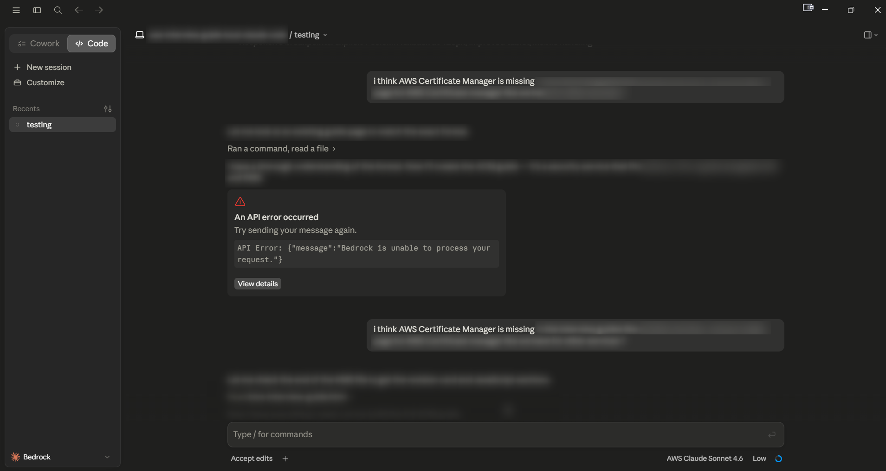
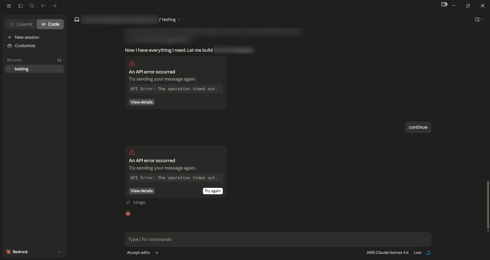
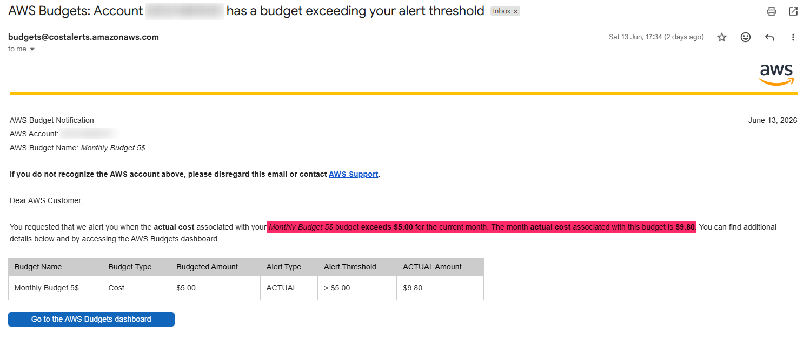
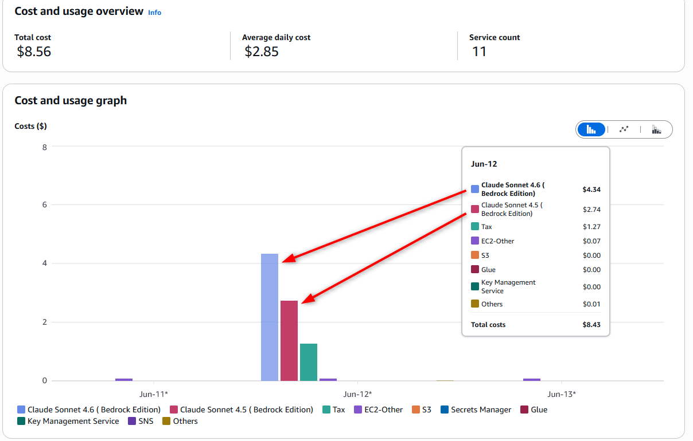
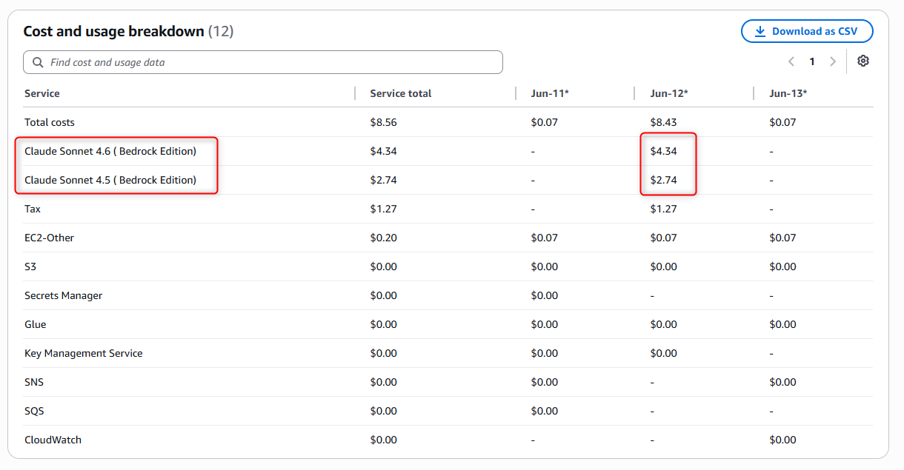
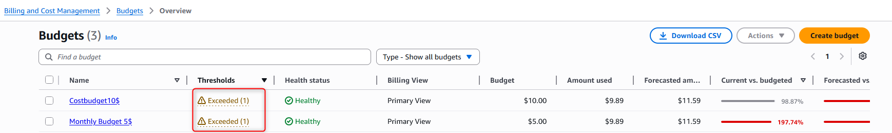

## My AWS Bedrock Experiment Cost Me $8.43 in Just One Day

*What I learned about AWS Bedrock pricing the hard way, and why budget alerts saved me*

---

## Why I Even Tried Claude Code on Bedrock

I have been using Claude Code for a while now, connected to Anthropic directly. It works well. But two things were bothering me.

First, the usage limits. Claude Code on Anthropic's native setup has 5hours session limit and a weekly usage cap. Once you hit it, you have to wait. If you are in the middle of something or just want to experiment freely, that gets frustrating fast.

Second, billing. I already manage everything on AWS. I'm very familiar with it, the invoices go to one place, and I understand how to track and control costs there. Adding a separate Anthropic subscription meant one more billing account, one more credit card charge, one more thing to track. I just wanted everything under one roof.

So I thought, why not try Claude Code connected to Amazon Bedrock? Same tool, runs on AWS, billed through AWS. Seemed like a clean solution to both problems.

What happened next is why I am writing this post.

---

## The Two Ways to Run Claude Code

Most people do not realise Claude Code can be configured to run in two different ways.

**Option 1: Claude Code via Anthropic directly**
You connect Claude Code to Anthropic's API or use it under your Claude subscription. Billing goes through Anthropic. If you are on a subscription plan, you pay a flat monthly fee and the usage limits apply to how much you can do within that.

**Option 2: Claude Code via Amazon Bedrock**
You connect Claude Code to AWS Bedrock as the backend. Same Claude models, but now AWS is your provider. Billing goes through your AWS account. No Anthropic subscription needed.

From the outside, it looks and feels the same. But the billing model underneath is completely different, and that is where things get interesting.

---

## What Happened When I Tried It

I set up Claude Code to use Bedrock and gave it a prompt. A fairly detailed one, nothing unusual, the kind I have run through Claude Code before without any issues.

What I got back was this:

> *API Error: {"message":"Bedrock is unable to process your request."}*

Okay, maybe a one-off. I tried again.

> *API Error: The operation timed out.*

And again.

> *API Error: The operation timed out.*

At one point Claude Code even said "Now I have everything I need. Let me build..." and then immediately hit a timeout. I asked it to continue. Same error. I asked again. Same error.

I never got a usable output. Not once.

---

## Then My Budget Alert Fired

I had already set up two AWS budget alerts before starting any of this. One at $5 and one at $10, I was alerted by my budget alert.

When I opened the AWS Cost and Usage dashboard, this is what I saw for a single day (June 12):

- Claude Sonnet 4.6 (Bedrock Edition): **$4.34**
- Claude Sonnet 4.5 (Bedrock Edition): **$2.74**
- Tax: **$1.27**
- Total for the period: **$8.43** (minor other AWS charges included)

My $5 monthly budget was sitting at **197.74% used**, with AWS forecasting $11.59 by end of month. For zero working output.

---

## Wait, It Charges Even When It Fails?

Yes. This is the part most people do not expect.

AWS Bedrock charges you based on tokens processed. Tokens are roughly the units of text going in (your prompt) and coming out (the response). You are not being charged for a successful result. You are being charged for the compute that happened while trying to process your request.

So every time I retried, my detailed prompt was being sent to Bedrock again. Each retry was being counted. Even the requests that timed out halfway through still consumed tokens on the input side.

This is not a flaw in how AWS works. This is exactly how pay-per-token cloud services are designed. But if you are coming from a flat-rate subscription mindset, it can catch you off guard quickly.

---

## The Cost Comparison That Really Surprised Me

Here is the part I want to highlight clearly.

Claude Code via Anthropic direct: roughly $20 per month (1999 INR if purchased through Google Play Store in India). That covers a lot of usage within the weekly limits.

Claude Code via Bedrock, in my case: $8.43 in a single day with few attempts, across a handful of prompts, none of which gave me a working result.

I was trying Bedrock partly to avoid the usage limits and consolidate billing. But what I ended up with was a higher cost for fewer results, billed in a way that is much harder to predict or control.

That does not mean Bedrock is the wrong choice. For teams with enterprise AWS accounts, compliance requirements, or very specific usage patterns, it can absolutely make sense. But for an individual developer experimenting or doing day-to-day coding work, the flat subscription through Anthropic is almost certainly the cheaper and more predictable option.

---

## What Made It Worse: Large Prompts and Retries

Longer prompts mean more input tokens, which means higher cost per attempt. When those attempts keep failing and you keep retrying, the cost multiplies fast even though you are getting nothing useful out of it.

On a flat subscription, retrying costs you nothing extra. On pay-per-token, every retry has a price.

This is something to keep in mind especially during the exploration phase, when you are naturally going to send things multiple times, adjust, and try again.

---

## What Saved Me: Budget Alerts Set Up in Advance

The only reason this stopped at $8.43 and did not keep going is that I had AWS Budgets configured before I started.

If you are on AWS and have not set this up yet, please do it before anything else. It takes about two minutes.

1. Go to AWS Console and search for **Billing and Cost Management**
2. Click on **Budgets** in the left menu
3. Click **Create budget**
4. Choose **Cost budget**
5. Set a monthly amount, even $5 is a good starting point
6. Add your email address and set alerts at 80% and 100%
7. Save it

**This will not stop charges from happening. But it will tell you when you are approaching a limit**, so you can make a decision before the bill gets out of hand.

---

## When Does Bedrock Actually Make Sense?

To be fair, there are real reasons to use Claude on Bedrock.

If your organisation is already deep in AWS and needs everything billed and audited in one place, Bedrock makes that possible. If you have data residency or compliance requirements that mean your prompts cannot leave AWS infrastructure, Bedrock gives you that control. If you are building a production application and want to integrate Claude into an existing AWS architecture, Bedrock fits naturally.

But if you are an individual developer who just wants to use Claude Code freely without hitting weekly limits, Bedrock is probably not the right solution. You are trading a predictable monthly cost for an unpredictable per-token cost, and in most cases you will spend more.

---

## What I Would Do Differently

Set up a budget alert before touching any new AWS service, especially anything AI-related.

Start with a tiny test prompt when trying a new model or service setup. Make sure it actually works at small scale before sending your real workload.

Understand what the error means before retrying. The "Bedrock is unable to process your request" error can mean the model is not available in your region, or you have hit a service quota. Retrying will not fix that, it will just add to the bill.

Know your pricing model before you start. Flat subscription and pay-per-token are very different things, and mixing them up is an expensive lesson.

---

## The Bottom Line

I spent $8.43 and got nothing working. That is not a huge amount, but the pattern it represents matters a lot if you scale it up or do not catch it early.

Cloud costs are quiet. They do not ask for permission. AI services on the cloud feel lightweight because all you are doing is typing a prompt, but what is happening on the billing side is a different story.

If you are exploring AWS Bedrock or any cloud AI service for the first time, set your budgets first, start with something small, and understand whether you are on a subscription model or a pay-per-token model before you begin.

Learned this one the slightly expensive way. Hopefully this saves someone else from the same surprise.

---

*Have you run into unexpected AWS charges when experimenting with AI services? Would love to hear about it in the comments.*

---

**Connect:** [X@venkatesh111](https://x.com/venkatesh111) | [YouTube@LetUsCloud](https://www.youtube.com/@letuscloud) | [LinkedIn@venkatesh111](https://www.linkedin.com/in/venkatesh111/)

