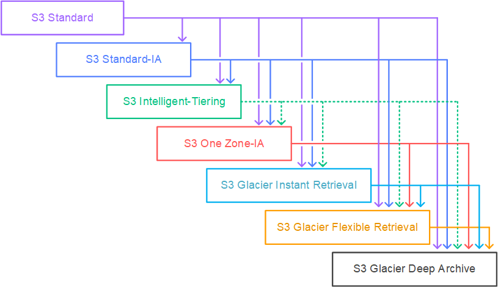
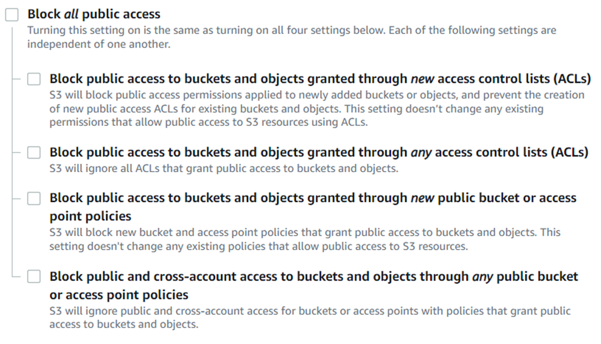
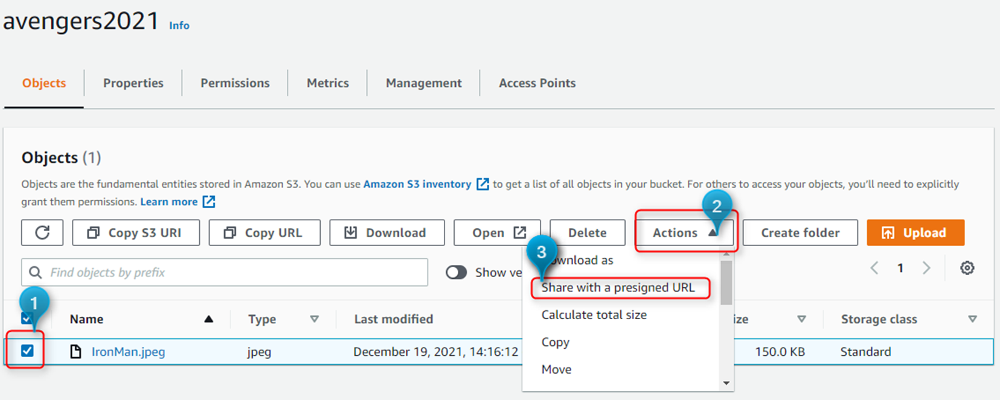
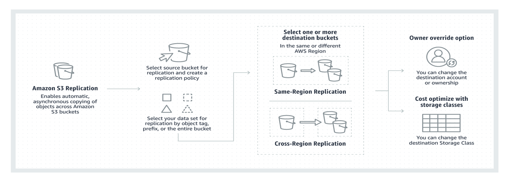
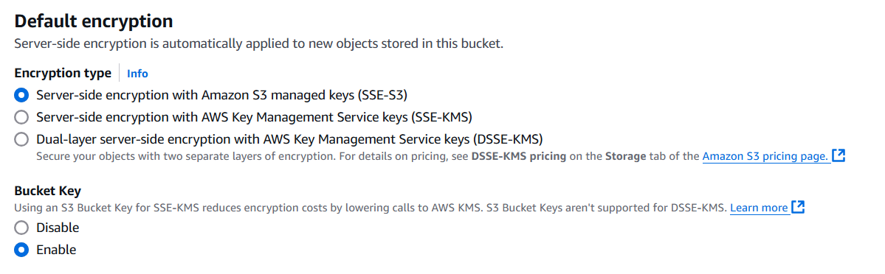

# Amazon S3

## Key Concepts

- Amazon S3 (Simple Storage Service) is an ***object storage*** service designed for 
   - **scalability**
   - **High Availability**
   - **Durability**
   - **Security**
   - **Performance**


- **Buckets**: Containers for storing objects. Each bucket has a **globally unique name**.
- **Objects**: Files stored in S3, consisting of *data*, *metadata*, and a *unique key* within the bucket.
- **High Availability** & **Durability** : S3 Objects are automatically stored across multiple devices spanning a minimum of three Availability Zones (S3 Standard, S3 Standard-IA, and S3 Glacier)
- **Data Protection**:
   - Encryption at *rest*
      - Server-side encryption with Amazon S3 managed keys (**SSE-S3**).
      - Server-side encryption with AWS Key Management Service keys (**SSE-KMS**)
      - Dual-layer (two separate layers of encryption) server-side encryption with AWS Key Management Service keys (**DSSE-KMS**)
   - Encryption in *transit* (HTTPS).
- **Storage Classes**:
   - **S3 Standard**: Frequently accessed data.
   - **S3 Standard-IA**: Infrequently accessed data.
   - **S3 Intelligent-Tiering**: Automatically optimizes cost for infrequent data.
   - **S3 One Zone-IA**: Infrequently accessed data, stored in single AZ
   - **S3 Glacier Instant Retrieval** : Long-term archival data with instant retrieval 
   - **S3 Glacier Flexible Retrieval**: Long-term archival data with retrieval times in minutes.
   - **S3 Glacier Deep Archive**: Lowest-cost storage with retrieval times in hours.
- **Versioning**: Maintains multiple versions of objects to protect against accidental overwrites or deletions.
- **Access Control**: Managed through *Bucket Policies*, *ACLs*, and *IAM policies*.
- **Lifecycle Management**: Automates moving objects between storage classes or deletion.
- **Cross-Region Replication (CRR)**: Automatically replicates data across AWS regions for disaster recovery.
- **Event Notifications**: Triggers actions when specific events occur, like object creation.
- **Object Lock**: Write-once-read-many (WORM) compliance to prevent object deletion.
- **Multipart Upload**: Uploads large files in parts for efficiency and reliability.

## Amazon S3 Durability and Availability

### Durability
- **Durability**: **Sustainability/loss of Data**
  - S3 offers high durability of ***99.999999999*** (or ***11 9’s***) for objects across multiple Availability Zones.
  - If you store 10,000,000 objects with Amazon S3, you can on average expect to incur a loss of a single object once every 10,000 years.
  - 11 9’s durability across all storage classes.

### Availability
- **Availability**: **Accessibility to the Data**
  - How readily the service is available?
  - Amazon S3 Standard offers 99.99% availability.
  - In a given year, S3 Standard may not be available for:
    - Yearly: 52m 35s
    - Monthly: 4m 22s
    - Weekly: 1m 0s
    - Daily: 8s
  - Availability varies from one storage class to another.

## Amazon S3 Storage Classes:


## Amazon Storage Life Cycle Policies:
 - A lifecycle policy is a set of rules that define how objects in an S3 bucket should be 
   - ***Transitioned*** between different storage classes 
   - ***Expired*** or deleted after a certain period. 

### 1. Transitions

- Transitions allow you to automatically **move objects between different S3 storage classes** as they age. 
- This helps optimize storage costs by moving less frequently accessed data to cheaper storage tiers. 

### 2. Expirations

- Expiration rules define when objects should be **permanently deleted** from the bucket. 
- This helps manage data retention and prevents unnecessary storage of outdated files.

####  Common Use Cases

##### 1. Archiving Old Data
- Move log files or backup data older than 30 days to cheaper storage classes
- Automatically delete project archives after 7 years

##### 2. Cost Optimization
- Transition infrequently accessed data to cheaper storage tiers
- Remove temporary files or older versions of objects

##### 3. Compliance and Retention
- Automatically delete sensitive documents after a specific retention period
- Ensure compliance with data retention policies
- S3 supports waterfall model for transitioning objects between storage classes.

  

## Amazon S3 Security

- **Identity-Based Policies** : Define *what* actions a user/group/role can perform

  ```  
  {
      "Version": "2012-10-17",
      "Statement": [
          {
              "Effect": "Allow",
              "Action": [
                  "s3:GetObject",
                  "s3:PutObject"
              ],
              "Resource": "arn:aws:s3:::venkatesh-bucket/*"
          }
      ]
  }
  ```

- **Resource-Based Policies** : Define *who* (*Principal*) can perform actions such as allow or deny
  ```
  {
    "Version": "2012-10-17",
    "Statement": [
        {
            "Sid": "PublicRead",
            "Effect": "Allow",
            "Principal": "*",
            "Action": "s3:GetObject",
            "Resource": "arn:aws:s3:::venkatesh-bucket/public/*"
        }
    ]
  } 
  ```


- **Access Control List (ACL)** : Fine-grained control over individual objects

- **Block Public Access** :
  - Block Public Access is applicable to only Public/Anonymous  access
  - Block public access settings **can override ACLs and bucket policies** public access
  - You can apply block public access settings to 
    - Individual buckets or to 
    - All buckets in your account
  - 

- **Presigned URLs**
  - Allows you to share objects or allow users to upload objects to buckets without AWS security credentials or permissions
  - Shared urls use logged in user credentials (but in a secure way) to access to objects
  
  - 

### Identity-Based Policies Vs Resource-Based Policies Vs ACLs

- 
  | **Description**          | **Identity-Based Policies**                                                                 | **Resource-Based Policies**                                                                                           | **Access Control List (ACL)**                                                                                   |
  |--------------------------|----------------------------------------------------------------------------------|---------------------------------------------------------------------------------------------------------------|-----------------------------------------------------------------------------------------------------------------|
  | **Attachment**           | Attached to *Users/Groups/Roles*                                                  | Attached to *buckets* and applicable at the bucket level                                                        | Attached to both buckets and individual objects                                                                 |
  | **Purpose**              | Define *what* actions a user/group/role can perform                               | Define *who* can perform actions such as allow or deny                                                        | Fine-grained control over individual objects                                                                    |
  | **Scope**                | Identity-level permissions                                                      | Bucket-level permissions                                                                                      | Bucket and object-level permissions                                                                             |
  | **Limitations**          | N/A                                                                             | You can't have a bucket policy for individual objects                                                         | ACLs are legacy, and AWS suggests using IAM policies                                                            |
  | **Best Use Case**        | Control user, group, or role actions within the AWS environment                 | Enable cross-account access or restrict access to specific IP ranges, services, or accounts                   | Provide quick and specific permissions for individual objects (if legacy usage or fine-grained permissions needed) |

## Amazon S3 Replication

- Automatic, ***asynchronous* copying of objects across Amazon S3 buckets**
- S3 Objects **can be configured to replicate across multiple destination buckets**
- You **can change the storage class** of replicated s3 objects when performing replication
- Replication options:
  - Across AWS Regions (CRR)
  - Within the Same AWS Region (SRR)
  - Across AWS accounts

- Replication configurations are **configured at SOURCE bucket**
- **Versioning Must be enabled on BOTH** source and destination buckets
- Specify Destination Bucket
- **IAM Role** that the S3 bucket should assume to replicate objects
- You can optionally change destination storage class
- Replication **only supports copying new S3 objects** after it is enabled

  


## Amazon S3 Encryption

- **Encryption at Rest**: Server-side encryption with Amazon S3 managed keys (SSE-S3)
- **Encryption in Transit**: Server-side encryption with AWS Key Management Service keys (SSE-KMS)
- **Dual-layer Encryption**: Dual-layer (two separate layers of encryption) server-side encryption with AWS Key Management Service keys (DSSE-KMS)
- **Encryption by Default**: Server-side encryption is enabled by default for new buckets

   

## Amazon S3 Event Notifications

- You can configure S3 to send notifications when certain events occur, such as object creation, deletion, or modification

- **Object Created** : Triggered when an object is created in a bucket
- **Object Deleted** : Triggered when an object is deleted from a bucket
- **Object Modified** : Triggered when an object is modified in a bucket

- Destination Includes :
  - **SNS** : Fan-out messages to systems for parallel processing or directly to people.
  - **SQS** : Send notifications to an SQS queue to be read by a server.
  - **Lambda** : Run a Lambda function script based on S3 events.

## Amazon S3 Access Points

- AWS S3 Access Points **solve the complexity of managing bucket policies for multiple teams and applications by creating separate access points with individualized policies for each team or use case**. 
- Traditional S3 bucket policies become difficult to manage as more teams and applications are added, leading to complex, hard-to-audit policies with limited size and flexibility.
- Create a **separate S3 access point for every user or application** that needs access to S3 bucket
- You can use **access points to control access to buckets, objects** (folders), or both
- With S3 Access Points, organizations can create multiple access points for a single bucket, each with its own unique properties:
  - **Unique S3 URI**
  - **Specific Access Point ARN**
  - **Customizable access policy**
  - **Network origin control** (internet or VPC-specific)

- Access Points **allow granular folder-level access control**, enabling different teams to access specific folders within the same S3 bucket while maintaining strict access boundaries.
- **Network origin** features let you restrict access points to specific VPCs or make them publicly accessible, providing enhanced security and network segmentation.
- To use Access Points effectively, **both the Access Point policy and the underlying bucket policy must permit the requested action**, with a recommended **bucket policy that delegates access control to the Access Points**.
- Deny policies can be implemented at both the Access Point and bucket levels to provide additional security, such as preventing object deletion in specific folders or restricting direct bucket access.

### Amazon S3 Access Points Best Practices:

- Granting minimal necessary permissions
- Using Access Point ARNs in IAM policies
- Delegating access control to Access Points through bucket policies
- Leveraging Access Points for scalable and manageable S3 access control

## Amazon S3 multi-region Access Points

- Multi-region Access Points enable you to create a single access point that spans multiple AWS Regions, providing a unified view of data across all Regions.
- **Multi-region Access Points** are useful for **cross-Region replication** and **cross-Region data access**.
- With Multi-region Access Points, you can **access data across multiple AWS Regions** using a single URL, ensuring data consistency and reducing the risk of data loss or corruption.


## References

- [Amazon S3](https://aws.amazon.com/s3/)
- [Amazon S3 Access Points](https://docs.aws.amazon.com/AmazonS3/latest/userguide/access-points.html)
- [Amazon S3 Replication](https://docs.aws.amazon.com/AmazonS3/latest/userguide/replication.html)
- [Amazon S3 Encryption](https://docs.aws.amazon.com/AmazonS3/latest/userguide/s3-encryption.html)
- [Amazon S3 Event Notifications](https://docs.aws.amazon.com/AmazonS3/latest/userguide/event-notifications.html)
- [Amazon S3 Access Points Best Practices](https://docs.aws.amazon.com/AmazonS3/latest/userguide/access-points.html#access-points-best-practices)
