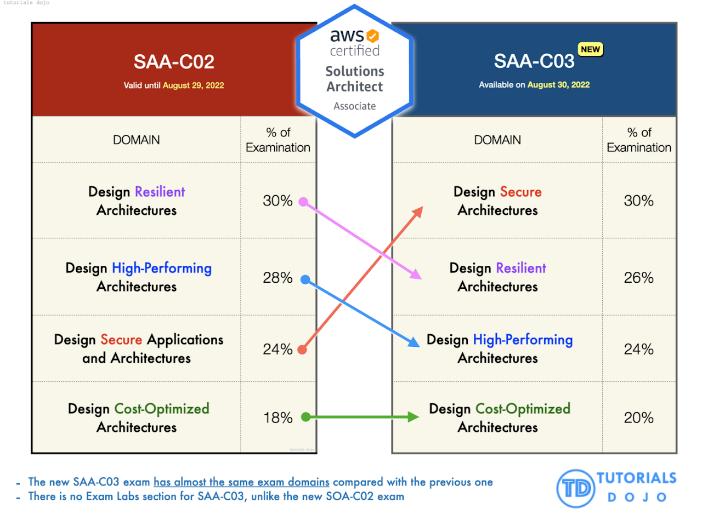

## AWS Solutions Architect Associate Cheat Sheet

## About This Cheat Sheet

This cheat sheet was prepared based on:

1. Udemy Practice tests by Jon Bonso, Neal Davis, Stephane Maarek
2. AWS Documentation
3. AWS FAQ
4. AWS Whitepapers

> **Note:** This sheet is for last-minute or quick reference only. These were my notes for a final day glance before the actual SAA exam.

---

## Credits

All credits to excellent SAA-C03 course and practice tests by:

- **Adrian Cantrill**
- **Chad Smith**
- **Jon Bonso**
- **Neal Davis**
- **Ranga Karnam**
- **Stephane Maarek**

You can enroll in **any ONE of the courses listed below + Practice Exams** to gain knowledge and clear the certification.

---

## Course Links

### Adrian Cantrill Course

- [AWS Certified Solutions Architect Associate SAA-C02](https://learn.cantrill.io/p/aws-certified-solutions-architect-associate-saa-c02)

### Chad Smith O'Reilly Live Classes

- [O'Reilly Learning](https://learning.oreilly.com) (search by "author: Chad Smith")

### Jon Bonso Practice Tests

- [Tutorials Dojo Practice Exams](https://portal.tutorialsdojo.com/courses/aws-certified-solutions-architect-associate-practice-exams/)
- [Udemy SAA-C03 Practice Exams](https://www.udemy.com/course/aws-certified-solutions-architect-associate-amazon-practice-exams-saa-c03/)

### Neal Davis Course & Practice Tests

- [Udemy Hands-on Course](https://www.udemy.com/course/aws-certified-solutions-architect-associate-hands-on/)
- [Udemy Practice Tests](https://www.udemy.com/course/aws-certified-solutions-architect-associate-practice-tests-k/)

### Ranga Karnam Course and Exam Review

- [Udemy Step-by-Step Course](https://www.udemy.com/course/aws-certified-solutions-architect-associate-step-by-step/)
- [Udemy Exam Review](https://www.udemy.com/course/exam-aws-certified-solution-architect-associate/)

### Stephane Maarek Course & Practice Tests

- [Udemy SAA-C02 Course](https://www.udemy.com/course/aws-certified-solutions-architect-associate-saa-c02/)
- [Udemy Practice Exams](https://www.udemy.com/course/practice-exams-aws-certified-solutions-architect-associate/)

---

## In-Detail Cheat Sheets by Neal and Jon

- [Digital Cloud Training Cheat Sheets](https://digitalcloud.training/category/aws-cheat-sheets/aws-solutions-architect-associate/)
- [Tutorials Dojo AWS Cheat Sheets](https://tutorialsdojo.com/aws-cheat-sheets/)

---

## AWS Official Study Guides and Trainings

- [AWS Certified Solutions Architect Associate Exam Guide](https://d1.awsstatic.com/training-and-certification/docs-sa-assoc/AWS-Certified-Solutions-Architect-Associate_Exam-Guide.pdf)
- [AWS Certified Solutions Architect Associate Exam Guide C03](https://d1.awsstatic.com/training-and-certification/docs-sa-assoc/AWS-Certified-Solutions-Architect-Associate_Exam-Guide_C03.pdf)
- [AWS Certified Solutions Architect Associate Sample Questions](https://d1.awsstatic.com/training-and-certification/docs-sa-assoc/AWS-Certified-Solutions-Architect-Associate_Sample-Questions.pdf)
- [Exam Readiness Course](https://explore.skillbuilder.aws/learn/course/external/view/elearning/125/exam-readiness-aws-certified-solutions-architect-associate-digital)

---

## SAA-C03 Update Information

The new exam SAA-C03 started from **Aug-2022**. Only the weight distribution for domains changed; no major changes from SAA-C02. See [What's New with the SAA-C03](https://tutorialsdojo.com/whats-new-with-the-saa-c03-aws-certified-solutions-architect-associate-exam-this-2022/) by Jon Bonso.

---

## My Tips on Practice Exams

- Practice exams are **not to determine pass/fail**, but to **test your understanding of AWS services** and **choose the most appropriate service for a scenario**.
- Read the entire question and every option, **think like a Solution Architect**, and **eliminate wrong answers**.
- **Google for help during practice exams** (not answers), to learn and make notes.
- After completion, **check explanations for every answer and make notes**.
- **Actual SAA-C03 is easier than practice exams** (practice tests help you learn and prepare).

---

## Connect with the Author

Are you preparing for SAA-C03? Have doubts or want to collaborate for AWS/DevOps certifications? Connect:

- Twitter: [venkatesh111](https://twitter.com/venkatesh111)
- LinkedIn: [venkatesh111](https://www.linkedin.com/in/venkatesh111/)

If planning for **AWS Certified Developer Associate**, see: [AWS DVA-C01 Cheat Sheet](https://sites.google.com/view/aws-dva-c01-cheat-sheet)

---

## Key Words - to watch out for in questions !

### Region

- Physical or **Geographical location**
- Made up of **two or more Availability Zones**
- Each region is isolated from others
- **Multiple Availability Zones** per region
- Data replication across regions is possible
- Communication between regions via public internet

#### AWS Region Examples

| Code         | Name                       |
|--------------|---------------------------|
| us-east-1    | US East (N. Virginia)     |
| ap-south-1   | Asia Pacific (Mumbai)     |
| eu-west-2    | Europe (London)           |
| me-south-1   | Middle East (Bahrain)     |

### Availability Zone

- Group of **one or more discrete data centres**
- Redundant power, networking, connectivity
- **Low latency, high throughput, highly redundant network**
- **Highly available, fault tolerant, scalable infrastructure**

### Durability

- **Likelihood of data loss**
- Example: Multiple copies of data in different locations increases durability
- AWS S3 offers **99.999999999% durability**

### Availability

- **How readily a service is available**
- Example: More ATM machines = higher availability
- Deploying EC2/RDS in multiple AZs increases availability

### Resilient

- **Recover from failure** induced by load, attacks, failures
- **Partial system failure doesn't take down the whole system**

### Fault Tolerant

- System remains operational even if some components fail

---

## AWS Services

## IAM

- Explicit deny policy always overrides explicit allow

### IAM Roles
- Using IAM Role for EC2, ASG is more secure than providing access via IAM user
- **ECS tasks can also be assigned with IAM ROLES** just like IAM Role or EC2 instances
- Want EC2 instance to access other AWS services (Example S3) use IAM ROLE
- **Sharing CloudTrail logs between AWS accounts** then use IAM Roles

### Cross Account Access
- Your developers/Ops want to access particular resources in 2 or more different (PROD, TEST) AWS accounts
- Temporary access to resources in a second account (use with STS)

### Custom Identity Broker
- If your On-Prem LDAP is not compatible with SAML, and you want users to use LDAP to authenticate to AWS use **custom identity brokers**

**Note:** You **cannot attach IAM Role to On-Prem Instances**, use IAM credentials

### External ID
- To **give a third-party access to your AWS resources** (delegate access)
- Monitor your AWS account and help optimize costs
- Perform some analytics etc

### IAM Best Practices
- Lock away your AWS account root user access keys
- Create individual IAM users
- Enable MFA
- Use user groups
- Grant least privilege
- Use roles for applications that run on Amazon EC2 instances
- Use roles to delegate permissions

[AWS IAM Best Practices Documentation](https://docs.aws.amazon.com/IAM/latest/UserGuide/best-practices.html)

**IAM permissions boundaries** helps you to restrict AWS IAM admin access and prevent privilege escalation, or allowing them to bypass any other security rules.

---
## S3

### Storage Classes Overview

| Storage Class                    | Use Case                                      | Retrieval Time         | Cost         |
|----------------------------------|-----------------------------------------------|-----------------------|--------------|
| S3 Intelligent-Tiering           | Unpredictable/changing access patterns        | Milliseconds          | Moderate     |
| S3 Standard                      | Frequently accessed data (>1/month)           | Milliseconds          | Standard     |
| S3 Standard-IA                   | Infrequently accessed, retained ≥1 month      | Milliseconds          | Lower        |
| S3 One Zone-IA                   | Reproducible, lower resiliency requirement    | Milliseconds          | Lowest IA    |
| S3 Glacier Instant Retrieval     | Rarely accessed, immediate retrieval needed   | Milliseconds          | Archive      |
| S3 Glacier Flexible Retrieval    | Rarely accessed, minutes–hours retrieval      | 1–12 hours            | Archive      |
| S3 Glacier Deep Archive          | Lowest cost, hours retrieval                  | 12–48 hours           | Lowest       |

### Glacier Retrieval Options

| Storage Class                    | Expedited      | Standard        | Bulk             |
|----------------------------------|----------------|-----------------|------------------|
| S3 Glacier Instant Retrieval     | N/A            | N/A             | N/A              |
| S3 Glacier Flexible Retrieval    | 1–5 min        | 3–5 hours       | 5–12 hours       |
| S3 Glacier Deep Archive          | N/A            | ≤12 hours       | ≤48 hours        |

### Replication at S3

**SRR – Same Region Replication**

-  **Aggregate logs into a single bucket** – If you store logs in multiple buckets or across multiple accounts, you can easily replicate logs into a single, in-Region bucket. Doing so allows for simpler processing of logs in a single location.
-   **Configure live replication between production and test accounts** – If you or your customers have production and test accounts that use the same data, you can replicate objects between those multiple accounts, while maintaining object metadata.
-  **Abide by data sovereignty laws** – You might be required to store multiple copies of your data in separate AWS accounts within a certain Region. Same-Region Replication can help you automatically replicate critical data when compliance regulations don't allow the data to leave your country.

### Encryption at S3

**Server-Side Encryption**
Request Amazon S3 to encrypt your object before saving it on disks in its data centers and then decrypt it when you download the objects.

**Client-Side Encryption**
Encrypt data client-side and upload the encrypted data to Amazon S3. In this case, you manage the encryption process, the encryption keys, and related tools.

**AWS KMS (SSE-KMS)**
- Encryption at rest
- Automatic key rotation every 1 year
- Operational efficiency (least manual efforts)

**Server-side Encryption (SSE):**
- Customer Provided Keys (SSE-C)
- S3 Managed Keys (SSE-S3)
- KMS Managed Keys (SSE-KMS)

**Client-side Encryption (CSE):**
- Customer managed master encryption keys (CSE-C)
- KMS managed master encryption keys (CSE-KMS)

In order to ensure all objects uploaded to S3 are encrypted, create an S3 bucket policy that denies any S3 Put request that does not include the `x-amz-server-side-encryption` header.

- `s3:x-amz-server-side-encryption: AES256` → use S3-managed keys
- `s3:x-amz-server-side-encryption: aws:kms` → use AWS KMS managed keys

https://aws.amazon.com/blogs/security/how-to-prevent-uploads-of-unencrypted-objects-to-amazon-s3/

For cost effective analysis on data stored on S3 use **Amazon Athena** to run SQL queries.

### S3 Object Lock

- prevent deleting or modifying object for fixed amount of time.
- Object Lock can help prevent objects from being deleted or overwritten for a fixed amount of time or indefinitely
- Object Lock to help meet regulatory requirements that require WORM (write-once-read-many) storage
- Adds layer of protection against object changes and deletion
- Object locks must be enabled at the time of creation of buckets (new bucket)
- Bucket versioning is automatically enabled (cant be disabled) for Object lock enabled buckets

### S3 Static website hosting

- Only for static content, can also contain client-side scripts.
- Does NOT support Server-side processing/scripting like PHP, JSP, or ASP.NET.

### Accessing S3 from EC2 or ECS

- IAM Role or Instance profile attached to EC2 to access S3
- Data transfer between S3 and EC2 in same region is FREE

### S3 Transfer Acceleration

- fast, easy, and secure transfers of files over long distances between your client and an S3 bucket
- S3 Transfer acceleration uses globally distributed edge locations in Amazon CloudFront
- Additional data transfer charges might apply.
- Use for large scale (more than 20GB) download and upload of data into S3 from various edge location

**Use cases**
- Your customers upload to a centralized bucket from all over the world.
- You transfer gigabytes to terabytes of data on a regular basis across continents.
- You can't use all of your available bandwidth over the internet when uploading to Amazon S3.

### S3 Cost

- Enabling versioning will have additional cost (each versioned objects are charged)
- Incomplete S3 multipart uploads are charged
- Data transfer cost between S3 buckets in same region is free

### VPC endpoint and S3

- VPC endpoint for Amazon S3 to upload files/images from EC2 instance in private subnet
- VPC endpoint for Amazon S3 reduces Direct connect costs

| Feature                                 | Gateway Endpoint for S3         | Interface Endpoint for S3                |
|------------------------------------------|---------------------------------|------------------------------------------|
| Network Traffic                         | Remains on AWS network          | Remains on AWS network                   |
| IP Addresses Used                        | Amazon S3 public IP addresses   | Private IP addresses from your VPC       |
| Access from On-Premises                 | No access                       | Allows access                            |
| Access from Another AWS Region          | No access                       | Allows access via VPC peering or Transit Gateway |
| Cost                                    | Free                            | Not free                                 |

---
## EFS

- EFS provides **hierarchical directory structure**
- Can be used with **both AWS and on-premises** resources
- **Access the files concurrently by multiple EC2 instances**
- Multiple compute instances, including **EC2, ECS (both Fargate and EC2 nodes), and Lambda, can access an EFS file system at the same time**

### EFS Storage Classes

- Reduce storage cost by moving to different EFS storage classes
- EFS will **automatically and transparently move your files** to the lower cost regional EFS Standard-IA or EFS One Zone-IA based on the last time they were accessed
- **Amazon EFS Intelligent-Tiering**: moves the files between storage class

### EFS Storage classes

- **EFS Standard-IA**
- **EFS One Zone-IA**

### Bursting Throughput mode

- It is the default mode, the amount of throughput scales as your file system grows, the more you store, the more throughput is available to you.
- Does not incur any additional charges and you have a baseline rate of 50 KB/s per GB of throughput that comes included with the price you pay for your EFS standard storage.

### Provisioned Throughput mode

- Allows you to **burst above your allocated allowance**, which is based upon your file system size, so if your file system was relatively small but the use case for your file system required a high throughput rate, then the default bursting throughput options may not be able to process your request quickly enough. In this instance, you would need to use provisioned throughput.
- This option does incur additional charges where you will need to pay for any bursting above the default capacity allowed from the standard bursting throughput.

---

## Amazon FSx

### Amazon FSx for Windows File Server
- Distributed File System Replication (**DFSR**) ↔ **Amazon FSx**
- Accessible over Server Message Block **(SMB) protocol**
- Amazon FSx is **accessible from Windows, Linux, and MacOS**
- You can use Active Directory domain for authentication

### Amazon FSx for Lustre
- Enable high performance computing (HPC)
- Mounting **FSx for Lustre on an AWS Fargate** launch type **isn't supported**. (Use EFS)
- Can be mounted on EC2 worker nodes

---

## AWS Snowball Edge

- **Offline data transfer** from remote areas (or on-prem) to AWS
- Unstable internet connection
- It has **on-board storage and compute power**, Provides you with storage and processing capacity
- Support local **data processing and collection in disconnected environments** such as **ships, windmills**, and **remote factories**
- Used by **disaster response team** in case of natural disasters like **hurricane**, **storm**
---

## AWS DataSync

- **Online data transfer** from on-prem to AWS
- **Unstable internet connection**
- Can be used even with **loss of Internet access for brief time**
  - *If a task is interrupted, for instance, if the network connection goes down or the AWS DataSync agent is restarted, the next run of the task will transfer missing files, and the data will be complete and consistent at the end of this run.*
- AWS DataSync is a **secure**, **online service** that automates and accelerates **moving data** **between on premises and AWS storage services**
- DataSync can copy data between:
  - **NFS, SMB, HDFS (Hadoop), EFS, FSx**
  - Self-managed object storage, AWS **Snowcone**, AWS **S3**
- **Migrate SMB/NFS** from On-Prem to AWS than choice is **AWS DataSync**
- **Use cases**:
  - **Migrate** your data to AWS, **Move data between on-premises and AWS**
  - **Reduce on-premises storage costs** by moving data directly to S3 Glacier
  - Replicate your data into AWS S3

---

## AWS Storage Gateway
### File Gateway
- **NFS/SMB**, over **file protocol**
- Supports **local (on-prem) caching**

#### Amazon S3 File Gateway
- Useful if you have application making use of EFS to gather and store the content and they may be processed by numerous Amazon EC2 Linux instances
- Data lakes, backups, and ML workflows

#### Amazon FSx File Gateway

### Volume Gateway
- **iSCSI block storage**
- **Hybrid cloud block storage**
- Supports **local (on-prem) caching**
- Volume Gateway stores and manages on-premises data in Amazon S3 on your behalf
- You can **take point-in-time copies** of your volumes (cached or stored) using **AWS Backup**

#### Cached Volume Gateway
- **Primary data** is stored in **Amazon S3**
- **Frequently accessed data is retained locally** (On-Prem) in the cache for **low latency access**

#### Stored Volume Gateway
- **Primary data** is stored **locally**
- **Entire dataset is available for low latency access** on premises while also **asynchronously getting backed up to Amazon S3**

### Tape Gateway
- **iSCSI VTL**
- Replacement for your on-prem physical tapes, without changing existing backup workflows
- Supports **local (on-prem) caching, Caches virtual tapes** on premises for **low-latency data access**
- Encrypts data between the gateway and AWS for secure data transfer
- Transitions virtual tapes **between Amazon S3 and Amazon S3 Glacier Flexible Retrieval, or Amazon S3 Glacier Deep Archive**, to **minimize storage costs**

---

## CloudFront

- Use **geographic restrictions (geo blocking)** to **prevent/block users in specific geographic locations (nations) from accessing content** that you're distributing through a CloudFront distribution
- You can use CloudFront for **on demand (VOD) or live streaming (real time) video**
- **To reduce latency** of the images/files hosted on S3 bucket use CloudFront
- **Cache media**, can serve secret/private content
- CloudFront is used for only Delivery (CDN) max download size over CloudFront is 20GB

### CloudFront Origin Access Identity (OAI)
- **Restrict** access to **Amazon S3** bucket so that **objects can be accessed only through my Amazon CloudFront distribution**

### High Availability with CloudFront
- You create an **origin group with two origins**: a **primary** and a **secondary**
- If the primary origin is unavailable CloudFront automatically switches to the secondary origin

#### Example
You have s3 bucket in us-west-1 and data is being replicated to ap-southeast-1 then:
1. Create an **additional CloudFront origin pointing** to the ap-southeast-1 bucket
2. Set up a CloudFront origin group with the **us-west-1** bucket as the **primary** and the **ap-southeast-1** bucket as the **secondary**

### Field-Level Encryption
- Adds an **additional layer of security** that lets you protect specific data throughout system processing so that **only certain applications can see it**
- Enable your users to **securely upload sensitive information to your web servers**

---

## Lambda@Edge

- Customized material (from website) **depending on the device (mobile, desktop, tablet)** from which they view the website
- Improve search engine optimization (SEO) for your website
- Route requests to different origins based on different viewer characteristics
- Route requests to origins within a **home region, based on a viewer's location**

[AWS Lambda@Edge Documentation](https://aws.amazon.com/lambda/edge/)

---

## AWS Global Accelerator

- With Global Accelerator, you are provided **two global static public IPs** that act as a fixed entry point to your application, **improving availability**
- AWS Global Accelerator **Reduce Internet latency**
- Corporate proxies (On-Prem) can also whitelist your application's static IP addresses in their firewalls
- Provides static IP which we can bind in the on-prem firewall
- **Add or remove your AWS application endpoints, such as ALB, NLB, EC2 Instances**, and **Elastic IPs** without making user-facing changes
- Real Time Messaging Protocol (**RTMP**), deliver content over **TCP** from across the globe
- AWS Global Accelerator also performs health checks automatically and route traffic to healthy endpoints

### CloudFront Vs Global Accelerator

#### CloudFront
- **HTTP**, Cacheable **TO** users over CDN

#### Global Accelerator
- **HTTP**, and **non-HTTP** such as **TCP, UDP** (gaming), **RTMP** (real time high video and audio), **MQTT** (IoT), **VoIP**
- From user location

---

## Amazon EC2

### Hibernation
- You are **not charged for Hibernated Instance usage**. You pay only for the EBS volumes and Elastic IP Addresses attached to it. There are no other hourly charges (just like any other stopped instance)
- To **preserve contents of the instance's memory** whenever the instance is unavailable
- The EBS root volume is restored to its previous state
- The **RAM contents are reloaded**

### Spot Instances
- Cost-effective choice if your **applications can be interrupted**
- Examples: data analysis, batch jobs, background processing

### Placement Groups
- There is **no charge** for creating a placement group

#### Cluster
- Packs **instances close together inside an Availability Zone**
- **Low-latency** and **high network performance** necessary for tightly-coupled **node-to-node communication**
- High Performance Computing **HPC applications**

#### Partition
- Groups of instances in one partition **do not share the underlying hardware** with groups of instances in different partitions
- Used by **large distributed and replicated workloads**, such as **Hadoop, Cassandra, and Kafka**

#### Spread
- Strictly places a small group of instances across **distinct underlying hardware** to reduce correlated failures

---

## AWS Elastic Beanstalk

- Ideal for simple web application, NOT ideal for micro services
- Supports Time Based scaling
- You can scale AWS Elastic Beanstalk environments on a defined schedule. Useful when you know the details around when issue is occurring
- Elastic Beanstalk **automatically handles the deployment, from capacity provisioning, load balancing, auto-scaling to application health monitoring**

---

## ECS - Elastic Container Service

- Auto Scaling can be triggered on ECS service based on **ECS services CPU utilization**
- For Amazon ECS cluster, using the **Fargate ECS task launch type**, use **AWS Application Auto Scaling** with **target tracking policies** to scale
- By default, **Fargate tasks are spread across Availability Zones**

---

## Elastic Load Balancers

### NLB (Network Load Balancer)
- Operates at **Layer 4**, TCP/UDP
- **Ultra-low latency**
- Can **handle tens of millions of requests per second** while **maintaining high throughput** at ultra-low latency

### ALB (Application Load Balancer)
- Operates at **Layer 7**, HTTP, HTTPS
- You can create a **listener rule on the ALB to redirect HTTP traffic to HTTPS**
- ALB supports path-based routing (route the traffic to different target group based on the url/path)

### Session Management

#### Sticky Sessions or Session Affinity (local)
- Route a site user to the **particular web server** that is **managing that individual user's session**
- It's **cost effective**, generally **fast** because **it eliminates network latency**

**Drawbacks:**
- In the event of **node failure, session data is lost**
- If using **ASG**, traffic may be **unevenly distributed**

#### Distributed Session
- **ElastiCache** for Redis, and ElastiCache for Memcached
- Provide a **shared data storage for sessions** that can be accessible from any individual web server
- There is additional cost and network latency
- These are extremely fast and provide sub-millisecond latency
- **Can cache any data**, not just HTTP sessions

[AWS Session Management Documentation](https://aws.amazon.com/caching/session-management/)

---

## Auto Scaling Groups

- You can perform **EC2 auto scaling based on SQS queue also**

### Scheduled Scaling
- Schedule according to predictable load changes
- Known holidays, known history
- Example: Every week the traffic to your web application **starts to increase on Wednesday, remains high on Thursday, and starts to decrease on Friday**, you can configure a schedule for Amazon EC2 Auto Scaling to increase capacity on Wednesday and decrease capacity on Friday

### Dynamic Scaling
- Reactive in nature

#### Target Tracking Scaling Policy
- **Unpredictable workloads** and **traffic spikes**
- To **keep the average aggregate CPU utilization** of your Auto Scaling group at X percent

### Predictive Scaling
- Regular patterns of traffic increases **(business hours)** and applications that take a long time to initialize
- Potentially **save you money on your EC2 bill** by helping you avoid the need to overprovision capacity
- **Cyclical traffic**, such as high use of resources during regular business hours and low use of resources during evenings and weekends
- **Recurring on-and-off workload patterns**, such as batch processing, testing, or periodic data analysis
- **Applications that take a long time to initialize**, causing a noticeable latency impact on application performance during scale-out events

### Suspend-Resume Feature
- **Temporarily pause scaling activities**
- Useful when you are **making a change or investigating a configuration issue**

---

## RDS

- **OLTP is RDS**
- **RDS Storage Auto Scaling** **automatically scales storage capacity** in response to growing database workloads, **with zero downtime**
- Using **AWS DMS**, you can **migrate Oracle relational database** running in an on-premises data center **to Amazon RDS** **without modifying the application's code**

### RDS Read Replica
- **Read replica for read operation**, helps improve RDS overall performance (as reads are redirected to read replica)
- Read Replica **support multi-region**

#### When you create a read replica
- Amazon RDS **takes a DB snapshot** of your source DB instance and begins replication
- If you create multiple read replicas only one snapshot is created at the start of the first create action
- You experience a **brief I/O suspension on your source DB instance** while the DB snapshot occurs

#### Points to consider for creating read replica
- You **must enable automatic backups on the source DB instance** by setting the **backup retention period to a value other than 0**
- **Long-running transaction can slow the process** of creating the read replica
- AWS recommend that you **wait for long-running transactions to complete** before creating a read replica

#### When to use Read Replica?
- For **performance improvement** of RDS (note Multi-AZ is for DR)
- For **internal systems request data** from the RDS DB instance
- Scaling beyond the compute or I/O capacity of a single DB instance for **read-heavy database workloads**
- Serving **read traffic while the source DB instance is unavailable** (data on the read replica may be "stale")
- **Business reporting** or **data warehousing scenarios**: You may want business reporting queries to run against a read replica rather than your primary, production DB Instance

### Additional RDS Notes
- **Standby Instance are AZ specific**, **read replicas can be over multiple regions**
- Use **AWS Secret Manager** to **protect your RDS database** with password **and automatic key rotation**
- **ElastiCache for Redis** to improve RDS DB instance **speed/performance**
- Gaming leaderboard, Top 10 players, real-time score update

### To create an encrypted RDS from unencrypted RDS
1. Take a Snapshot of the RDS instance
2. Create an encrypted copy of the snapshot
3. Restore the RDS instance from the encrypted snapshot

### Multi AZ RDS Deployment
- RPO less than 1 sec
- Multi AZ RDS deployment is limited to same region, **Cross-Region Multi-AZ isn't supported**

### RDS HA and DR Metrics

| Feature | RPO (approx) | RTO (approx) |
|---------|--------------|--------------|
| Amazon RDS Multi-AZ | 0 | 1-2 Minutes |
| Read replica promotion (in-Region) | Minutes | < 5 Minutes |
| PITR (in-Region) using automated backups | 5 Minutes | Minutes-Hours |
| PITR (cross-Region) using automated backups | 6-20 Minutes | Minutes-Hours |
| Snapshot restore | Hours | Minutes-Hours |

[AWS RDS Read Replicas Documentation](https://docs.aws.amazon.com/AmazonRDS/latest/UserGuide/USER_ReadRepl.html)
[AWS RDS FAQ](https://aws.amazon.com/rds/faqs/)

---

## AWS Aurora

- Multi-Region DB
- Multi-AZ DB, and read performance issue from secondary than Aurora is choice, **read replication latency of less than one second**
- Aurora **Auto Scaling for the read replica**, helps with **read replica latency issue** if any

### Aurora Global Database (DR Purpose of aurora)
- Provides disaster recovery from region-wide outages, use for **DR purpose between 2 different aws region**
- Allows a single Amazon Aurora database to **span multiple AWS regions**
- Replicates your data with no impact on database performance, enables fast local reads with low latency in each region
- **RPO is 1 second** and **RTO is less than 1 minute**

### Aurora Serverless
- Automatically starts up, shuts down, and scales capacity up or down based on your application's needs
- Run your database in the cloud without managing any database capacity
- You can **create a database endpoint without specifying the DB instance class size**
- Useful for infrequently accessed Database (For example, your database usage might be heavy for a short period of time, followed by long periods of light activity or no activity at all.)

[AWS Aurora Serverless Documentation](https://aws.amazon.com/rds/aurora/serverless/)

### Aurora Read Replicas
- Useful to improve performance of primary DB of Amazon Aurora
- **Offload read workloads** from the primary DB instance
- Supports **only read operations**
- Each Aurora DB cluster can have **up to 15 Aurora Replicas**
- Maintain **high availability** by locating Aurora Replicas in **separate Availability Zones**
- Aurora **automatically fails over** to an Aurora Replica in case the primary DB instance becomes unavailable

---

## AWS RedShift

- **Data warehousing**
- Both structured and unstructured
- Complex or **complicated analytical queries and joins**

---

## Amazon EMR

- Perform **Big Data analytics**
- Big Data processing, examples: Apache Spark, Hive, Presto

---

## Lambda

- Max runtime 15min
- **Minimal operational overhead expenditures** → Lambda (not EKS or EC2 or ECS)

---

## DynamoDB

- Can handle several **million queries per second** at its peak and **respond in milliseconds**
- User data in the form of **JSON documents**, then it is DynamoDB (not RDS)
- Key-value store → DynamoDB
- The **maximum item size** in DynamoDB is **400 KB**

### On-Demand
- Your **application traffic is difficult to predict (unpredictable) and control**
- **Flash sale**
- Your workload has **large spikes of short duration**, or if your average table utilization is well below the peak
- New applications, or applications whose database **workload is complex to forecast**
- Developers working on **serverless stacks with pay-per-use pricing**
- SaaS provider and independent software vendors (ISVs) who want the simplicity and resource isolation of deploying a table per subscriber

### VPC Endpoints for DynamoDB
- Helps you to **connect to DynamoDB within AWS network** (VPC)
- You need **route table entry** created for the endpoint

### DynamoDB Time to Live (TTL)
- TTL is useful if you **store items that lose relevance (delete items) after a specific time**

#### Use cases:
- Remove **user or sensor data after one year of inactivity in an application**
- **Archive expired items** to an Amazon S3 data lake via Amazon DynamoDB Streams and AWS Lambda
- **Retain sensitive data for a certain amount of time** according to contractual or regulatory obligations
- Orders placed **after one month will no longer be monitored**

### Secondary Index
- Search item using more than one key: value
- Tracking ID, or customer ID, or order ID

**Minimal operational overhead expenditures** → DynamoDB (not RDS)

### DynamoDB Accelerator (DAX)
- Fully managed, highly available In-memory caching system used in front of DynamoDB
- **Performance improvement** from **milliseconds to microseconds** for DynamoDB

---

## API Gateway

- **RESTful** services, **REST APIs**
- **Minimal operational overhead expenditures** → Lambda (not EKS or EC2 or ECS)

---

## Serverless Microservices

**Minimal operational overhead expenditures** design serverless:

### Frontend/Web Layer
- S3 with CloudFront static website hosting

### Application Layer
- API Gateway and AWS Lambda functions
- API Gateway, NLB and AWS Fargate
- ALB and AWS ECS

### DB Layer
- DynamoDB → DB layer to store user data
- Aurora → DB layer to store user data
- ElastiCache → DB layer to store/cache user data

---

## CloudWatch

- To get **Memory and disk related metric install cloudwatch agent**
  - Example: SwapUtilization
- You can configure an Amazon **CloudWatch alarm that triggers the recovery of the EC2 instance** if it becomes impaired (**Instance check fails** only not system check fails)

---

## CloudTrail

- By **default, only *Management events* are logged** and **not data events**
- Additional charges apply for **data** or **Insights** events

### Protecting CloudTrail Logs
- Log to a **dedicated and centralized Amazon S3 bucket**
- Enable **CloudTrail log file integrity**
- [Encrypting CloudTrail log files with AWS KMS-managed keys (SSE-KMS)](https://docs.aws.amazon.com/awscloudtrail/latest/userguide/encrypting-cloudtrail-log-files-with-aws-kms.html)
- [Amazon S3 bucket policy for CloudTrail](https://docs.aws.amazon.com/awscloudtrail/latest/userguide/create-s3-bucket-policy-for-cloudtrail.html)
- [Sharing CloudTrail log files between AWS accounts](https://docs.aws.amazon.com/awscloudtrail/latest/userguide/cloudtrail-sharing-logs.html)
- By **default**, the log files delivered by CloudTrail to your bucket are encrypted by **SSE-S3**
- To provide a security layer that is directly manageable, you can instead use **server-side encryption with AWS KMS-managed keys (SSE-KMS) for your CloudTrail** log files

[CloudTrail Security Best Practices](https://docs.aws.amazon.com/awscloudtrail/latest/userguide/best-practices-security.html)

### To share CloudTrail log files between multiple AWS accounts
1. Create an **IAM role** for each account that you want to share log files with
2. For each of these IAM roles, create an **access policy that grants read-only access** to the account you want to share the log files with
3. Have an **IAM user in each account programmatically assume the appropriate role** and retrieve the log files

[CloudTrail Log Sharing Documentation](https://docs.aws.amazon.com/awscloudtrail/latest/userguide/cloudtrail-sharing-logs.html)

---

## Route 53

### A Record
- A record value is **always an IP address**
- A record maps your website like example.com to IP address (ex: Elastic IP)

### CNAME
- CNAME can never be an IP address
- CNAME record **maps a name to another name**
- CNAME are for actual DNS servers, you **can't create a CNAME record for example.com**

#### Example:
- An **A** record for **example.com** points to the server **IP address**
- A **CNAME** record for **www.example.com** points to **example.com**

### Alias
- Alias record is an **Amazon Route 53-specific** virtual record
- It **works only with Amazon Route 53** (AWS specific resources)

#### AWS specific resources:
- ELB
- CloudFront Distribution
- Elastic Beanstalk
- S3 static websites
- From **one record** in a hosted zone **to another record**

### AAAA Record
- AAAA record is similar to an A record but it is for **IPv6 addresses**

### MX Record
- MX records (Mail Exchange records) is used for setting up Email servers
- MX records must be mapped correctly to deliver email to your address

**Important:** A **CNAME can't be used for naked/root domain names**. **Root domain names must be mapped with either an A record** **or** **an Alias record** (in Route 53).

### Route 53 Routing Policies

#### Simple Routing Policy
- Route traffic to **single resource**

#### Failover Routing Policy
- **Active-passive failover**

#### Latency Routing Policy
- You **have resources in multiple AWS Regions** and you want to route traffic to the Region that provides the **best latency** with less round-trip time

#### Geolocation Routing Policy
- Route traffic based on the **location of your users**

#### Geoproximity Routing Policy
- Route traffic based on the **location of your resource**
- **Shift traffic from resources in one location to resources in another**

#### Multivalue Answer Routing Policy
- You want **Route 53 to respond to DNS queries** with up to **eight healthy records** selected at random
- Return multiple values for a DNS query and **route traffic to multiple IP addresses**
- Associating a **Route 53 health check with records**

#### Weighted Routing Policy
- Route traffic to multiple resources in proportions (**based on weight 30%, 60% etc**) that you specify

[DNS Records Reference](https://www.whizlabs.com/blog/dns-records/)

---

## SQS

- **Decouple** your architecture

### Standard Queues
- **At-least-once** message delivery
- **Duplicate messages** can be delivered
- **Best effort** ordering
- **Better throughput** than FIFO

### FIFO Queues
- **Exactly-once** processing
- **No Duplicate** messages
- **FIFO** Order
- **Low throughput**

### SQS Temporary Queue Client
- **Request-Response** method, **short-lived**, **lightweight messaging** destinations
- No intention to use SQS for long term
- Leverages virtual queues instead of creating/deleting SQS queues

### Additional SQS Notes
- Use **SQS FIFO** for **Asynchronously updates to database**, **avoid dropping writes to the database**

#### Deduplication of messages can be enabled by:
- Enable **content-based deduplication**
- Explicitly provide the **message deduplication ID**

**Priority:** Use **separate queues (both can be standard Q) to provide prioritization** of work and **EC2 to perform prioritization**

---

## Amazon Kinesis

- Collect, process, and analyze **real-time, streaming data**
- **Real-time data** processing
- **Clickstream data** processing
- It is fully managed, highly scalable
- Default retention is 24hrs, but can be extended to 7days (useful when the destination (S3) is not getting all the data from Kinesis)

### Kinesis Video Streams
- Securely **stream video** from connected devices to AWS for analytics, machine learning (ML), and other processing

### Kinesis Data Streams
- **Real-time data streaming service** that can continuously capture **gigabytes of data per second** from hundreds of thousands of sources

### Kinesis Data Firehose
- **Capture, transform, and load data streams** into AWS data stores for near real-time analytics

### Amazon Kinesis Data Analytics
- **Process data streams in real time with SQL or Apache Flink** without having to learn change existing code/application

---

## SNS

### Fanout Scenario
- Message published (S3 event notification) to an SNS topic is replicated and pushed to multiple endpoints, such as **Kinesis Data Firehose** delivery streams, Amazon **SQS** queues, HTTP(S) endpoints, and **Lambda** functions. This **allows for parallel asynchronous processing**

Example: Event-based strategy to run the **multiple programs in parallel**

---

## SES

- Send **mail from within any application**
- Send email **securely, globally, and at scale**

### Use Cases
- **Transactional** emails (**purchase confirmations or password resets**)
- **Marketing** emails (**promotions, special offers and newsletters**)
- **Mass email** communications (**notifications and announcements**)

---

## AWS Secrets Manager

- Automatic Key Rotation possible
- Helps **RDS database with password protection and automatic key rotation**
- **Application on EC2**, or if **Lambda function needs credentials to be retrieved** than best choice is AWS Secrets Manager

---

## AWS Inspector

- Automated **vulnerability management service** that **continually scans EC2 and container workloads** for **software vulnerabilities** and **unintended network exposure**
- **AWS Inspector is specific to EC2** and **Container workloads**
- Provides Automated Security Assessments for EC2 instances
- **Requires agent installation on EC2** for Host (vulnerability assessment/best practices) OR can do Network Assessment for EC2 without installing agent

---

## AWS GuardDuty

- **Threat detection** service that **continuously monitors your AWS accounts and workloads for malicious activity**
- It uses Machine Learning, anomaly detection
- Can protect against Crypto Currency attacks

### Aim is to analyze logs:
- **CloudTrail Logs**: unusual API calls, unauthorized deployments
- **VPC Flow Logs**: unusual internal traffic, unusual IP address
- **DNS Logs**: compromised EC2 instances sending encoded data within DNS queries

---

## AWS Macie

- Macie helps identify and alert you to sensitive data, such **as personally identifiable information (PII)**
- AWS Macie is **specific to S3**

---

## AWS Shield

- **Avoid DDoS Attacks**

---

## AWS WAF

- AWS Web Application Firewall (WAF) **protect web applications and APIs from attacks**
- AWS WAF is your **first line of defense against web exploits**
- Use AWS WAF to **protect your API Gateway APIs**
- Protect from **SQL injection, Cross-site scripting (XSS)**
- Protect **against HTTP flooding attacks**
- Use AWS WAF to **access or restrict from embargoed nation**

### Important Notes
- **AWS WAF rules are evaluated before other access control features**, such as resource policies, IAM policies, Lambda authorizers, and Amazon Cognito authorizers
- WAF can be integrated with **Application Load Balancer** (**ALB**) (and NOT NLB)

### You can deploy AWS WAF on:
- **CloudFront**
- **Application Load Balancer**
- **API Gateway**
- **AWS AppSync**

[AWS WAF with API Gateway Documentation](https://docs.aws.amazon.com/apigateway/latest/developerguide/apigateway-control-access-aws-waf.html)

---

## VPC

### Expanding the VPC's IP Address Capacity
- It's **NOT possible to change/modify the IP address range** **of an** **existing VPC or subnet**

#### You can do one of the following:
- **Add an additional IPv4 CIDR block as a secondary CIDR** to your VPC
- Create a new VPC with your preferred CIDR block and then migrate the resources from your old VPC to the new VPC (if applicable)

#### Additional Notes:
- You **cannot disable IPv4 support for your VPC and subnet**
- You **can have both IPv4 and IPv6**, **but not just IPv6** in your VPC

### VPC Sharing
- Allows multiple AWS accounts (within Same AWS Organization) to create their application resources, such as EC2, RDS, Redshift clusters, and Lambda functions, into shared, centrally-managed virtual private clouds (VPCs)

#### Use case:
- **EC2 from "Test Account" want to access Redshift cluster in "Prod Account"**

### VPC Flow Logs
- Capture information about the **IP traffic going to and from network interfaces** in your VPC
- VPC Flow **log data** can be **published** to:
  - **Amazon CloudWatch Logs**
  - **Amazon S3**

#### Flow logs can be used for:
- Monitoring the **traffic that is reaching your instance**
- **Diagnosing** overly restrictive **security group rules**
- Determining the direction of the **traffic to and from the network interfaces**

## NAT Gateway

- NAT Gateway is **resilient within a single-AZ** (loss of AZ is loss of NAT Gateway)
- Must **create multiple NAT Gateway in multiple AZ** for **fault-tolerance**
- **Launched in Public subnet**, can be used by private instance to connect (routes need to be added) to internet

## Site-to-Site VPN Connections

- Site to site VPN connection can be **established immediately**
- Site to site VPN connection is **cheaper** (compared to AWS Direct Connect)
- A single VPN tunnel still has a **maximum throughput of 1.25 Gbps**
- **Use AWS Transit Gateway to scale an AWS Site-to-Site VPN throughput** beyond a single IPsec tunnel's maximum limit of 1.25 Gbps limit
- To **resolve slower VPN connection**, use a **transit gateway** with **equal cost multipath routing** and **add additional VPN tunnels**
- **Transit Gateway** enables you to **scale the IPsec VPN throughput** with **equal cost multi-path (ECMP) routing** support over **multiple VPN tunnels**

[Scaling VPN Throughput with Transit Gateway](https://aws.amazon.com/blogs/networking-and-content-delivery/scaling-vpn-throughput-using-aws-transit-gateway/)

---

## AWS Direct Connect

- Data transfer pricing over Direct Connect is lower than data transfer pricing over the internet

### Maximum Resiliency (resiliency as much as possible) for critical or crucial Workloads
- **Separate connections** terminating on separate devices in **more than one location**

#### Resilience to:
- Device failure
- Connectivity failure
- Complete location failure

### High Resiliency for Critical Workloads
- One connection at multiple locations

#### Resilience to:
1. Device failure
2. Connectivity failure due to a fiber cut
3. Complete location failure

[AWS Direct Connect Resiliency Recommendations](https://aws.amazon.com/directconnect/resiliency-recommendation/)
[AWS Direct Connect Disaster Recovery](https://docs.aws.amazon.com/directconnect/latest/UserGuide/disaster-recovery-resiliency.html#failover)

### Multiple VPC Connection
- To connect multiple VPC (Prod, Dev, Test) with On-prem and avoid resource sharing among the connected devices create an **AWS Direct Connect connection** and a **VPN connection for each VPC** **to connect back to the data center**. You cannot use Transit gateway here because you need to avoid resource sharing between VPC

[Transit Gateway VPC Connection Documentation](https://aws.amazon.com/premiumsupport/knowledge-center/transit-gateway-connect-vpcs-from-vpn/)

---

## AWS Organizations

You can use **aws:PrincipalOrgID** condition key in your resource-based policies (S3 bucket policies) to more easily **restrict access to IAM principals from accounts** in your AWS organization.