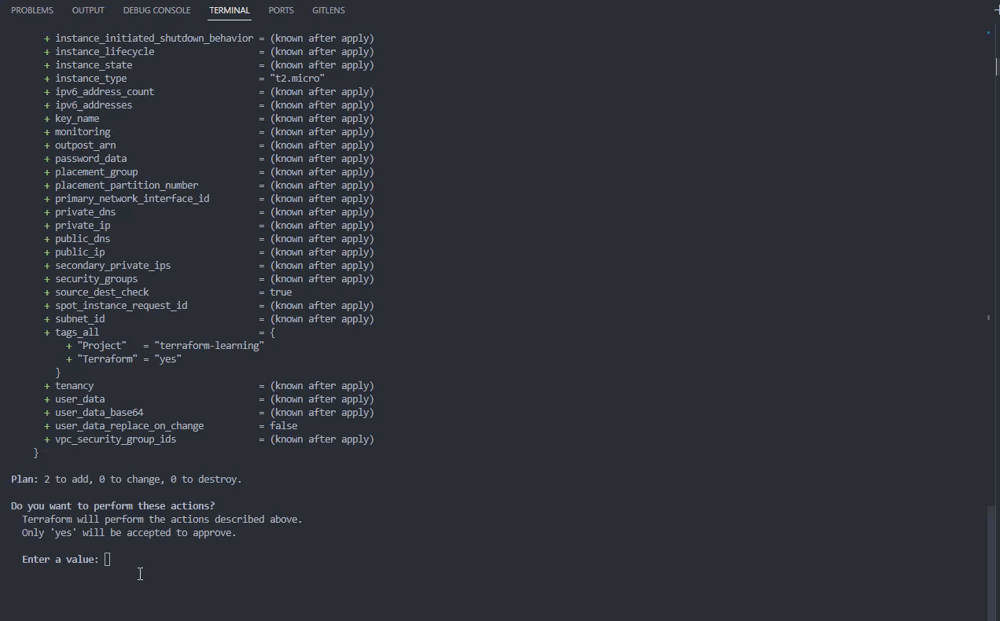
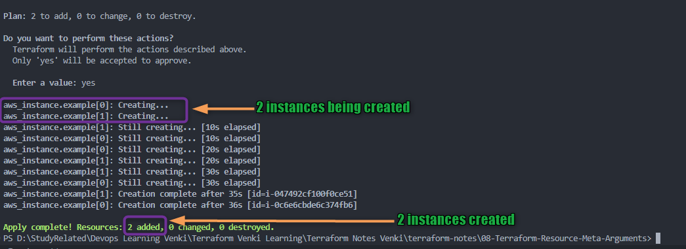
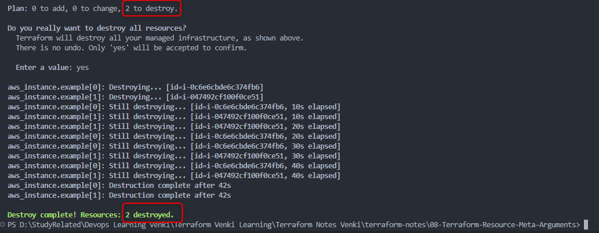

# Terraform Meta Argument : Count

## Terraform Meta Argument: *`count`*

### ***`count`*** Meta Argument

- The ***count*** Meta Argument allows you to **specify the number of instances of a resource you want to create**. 
- ***count*** is used when you **need multiple identical resources with the same configuration**.
- ***count*** can be used with **modules** and with **every resource type**
- The ***count*** argument **must be a non-negative whole number**. 
- If ***count*** is **set to 0**, it **will not create any instances of the resource**. 
- You can also **use expressions** to determine the count dynamically.
- When each instance is created, it has its own distinct infrastructure object associated with it, so **each can be managed separately**. When the configuration is applied, each object can be created, destroyed, or updated as appropriate.

- ***`count.index`***
    - ***count.index*** is a spacial variable used in conjunction with the *count* Meta Argument.
    - ***count.index*** allows you to access the current index of a resource instance within a count block. 
    - This can be particularly useful when you need to make resource configurations that are unique or depend on their position in the list of instances created by count.

- **Note** : A **given resource or module block cannot use both ***count***** and ***for_each*** .

- **Example**:  
    [00_provider.tf](./assets/01-tf-meta-argument-count/00_provider.tf)
    ```hcl
    terraform {
    required_providers {
        aws = {
            source = "hashicorp/aws"
            version = "~> 5.0" 
        }
    }
    }

    provider "aws" {
        region = "us-east-1"

        default_tags {
        tags = {
            Terraform = "yes"
            Project = "terraform-learning"
        }
        }
    }
    ```

    [01_ec2.tf](./assets/01-tf-meta-argument-count/01_ec2.tf)
    ```hcl
    resource "aws_instance" "example" {
        count = 2 # Using Meta argument to create 2 identical EC2 Instances
        ami           = "ami-0df435f331839b2d6"
        instance_type = "t2.micro"
    }
    ```

- Lets Execute Terraform commands to understand resource behavior

    1. ***`terraform init`*** : *Initialize* terraform
    2. ***`terraform validate`*** : *Validate* terraform code
    3. ***`terraform fmt`*** : *format* terraform code
    4. ***`terraform plan`*** : *Review* the terraform plan
    5. ***`terraform apply`*** : *Create* Resources by terraform
        - Example of *`terraform apply`*
            
            

        - After you type ***yes*** to *`terraform apply`* prompt, terraform will start **creating** resources.
            
            

        - Once terraform completes the execution you should be able to check on your AWS Console 2 EC2 Instance created successfully
            
 
    6. ***`terraform destroy`*** : *destroy or delete* Resources, Cleanup the resources we created
        - After you type ***yes*** to *`terraform destroy`* prompt, terraform will start **destroying** resources

        
        


        - Once terraform completes the execution you should be able to check on your AWS Console both EC2 successfully terminated.
        

-  #### ***`count.index`*** 
    - Example Code for  ***count.index*** 
        ```hcl
        resource "aws_instance" "example" {
        count         = 2
        ami           = "ami-0df435f331839b2d6"
        instance_type = "t2.micro"

        tags = {
            Name = "Instance-${count.index + 1}"
        }
        }    
        ```
    - In this example, we are creating two AWS EC2 instances with the same AMI and instance type. However, the tags block utilizes *count.index* to set a unique name tag for each instance. By adding 1 to *count.index*, we ensure the instance names are "Instance-1" and "Instance-2"."

    - Notes: *count.index* is a zero-based index, meaning it starts from 0. You can use it to create dynamic and unique resource configurations for each instance created using count.

## References

- [The count Meta-Argument](https://developer.hashicorp.com/terraform/language/meta-arguments/count)

