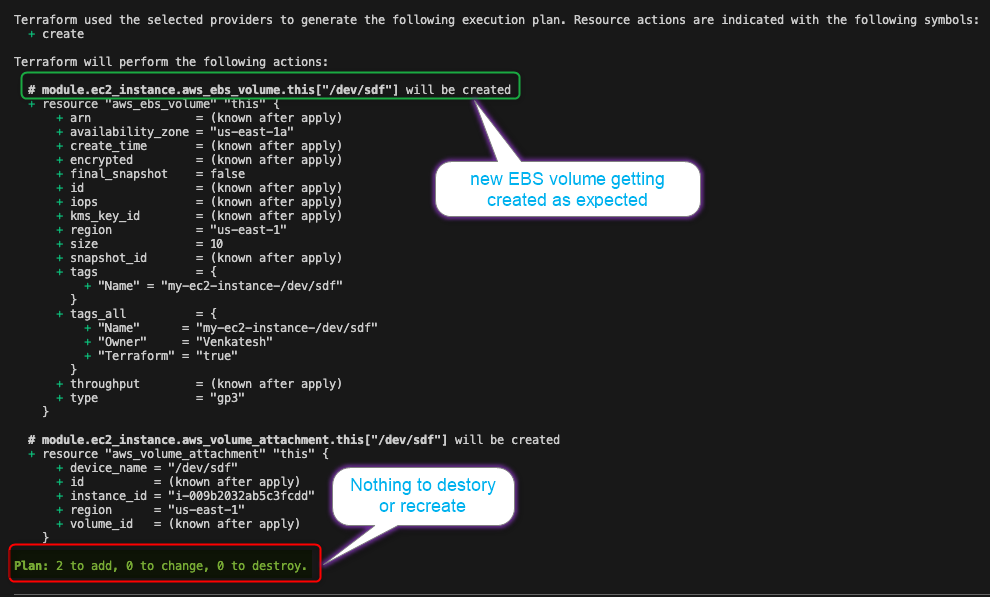

## The Problem That Hit Me

So there I was, working on our infrastructure at the office, feeling pretty confident about our Terraform setup. We had EC2 instances running smoothly, everything was working fine. Then came the request that seemed simple enough: "Can you add another EBS volume to our existing EC2 instance?"

"Sure, no problem," I thought. How hard could it be, right?

Well, that's when I ran into what became a proper nightmare. Every time I tried to add a new EBS volume to our already deployed EC2 instance using the [terraform-aws-modules/terraform-aws-ec2-instance](https://github.com/terraform-aws-modules/terraform-aws-ec2-instance) module, Terraform wanted to completely replace the entire instance. Not just add the volume, but replace the whole thing!

## Why This Was Such a Big Deal

Now, this wasn't a production environment, but it was still a critical project with tight delivery requirements. For those who haven't been in this situation, let me explain why instance replacement is terrible news:

- **Project Delays**: Rebuilding instances takes time we didn't have in our delivery schedule
- **Data Loss Risk**: If you're not careful, you could lose data on the existing volumes
- **Configuration Management**: All your instance-specific configurations need to be rebuilt
- **Testing Impact**: Having to recreate and revalidate everything disrupts the testing timeline

This wasn't just annoying, it was threatening our project deadline. We needed a clean way to add new EBS volumes without recreating the entire EC2 instance.

## What Was Actually Happening

The issue was with how the [terraform-aws-modules/terraform-aws-ec2-instance](https://github.com/terraform-aws-modules/terraform-aws-ec2-instance) module handled EBS volumes. When you modify the EBS volume configuration for an existing instance, instead of creating the new volume and attaching it (which is what you'd want), the module was treating it as a change that required instance replacement.

This behavior made sense from a Terraform perspective, it was being cautious about state changes, but it definitely didn't make sense from a practical operations perspective.

### Sample code

So my current Terraform configuration looked something like this:

- I was using AWS provider <= 5.8.0

    - 

- I was using AWS EC2 module 5.8.0
- I added new EBS volume terraform block and tried to run the terraform plan  

    ```hcl  
        ebs_block_device = [
            {
            device_name           = "/dev/sdf"
            volume_size           = 10
            volume_type           = "gp3"
            delete_on_termination = true
            }
        ]
    ```

    - 

With happy mind i ran *`terraform plan`* and to my surprise terraform was planning to replace the EC2 instance, instead of adding the new volume 😲

- 

## The Frustrating Search for Solutions

I spent way too much time trying to work around this. I tried:

- Using separate `aws_ebs_volume` and `aws_volume_attachment` resources outside the module
- Manually importing existing volumes into the Terraform state
- Looking for different configuration approaches

None of these felt like clean solutions initially. One of the possible work around shared by a community member on the GitHub issue is as below,

## The Possible Workaround Shared by a Community Member

While searching for solutions, I found a detailed workaround shared by a community member HeikoMR on the GitHub issue (https://github.com/terraform-aws-modules/terraform-aws-ec2-instance/issues/401#issuecomment-2325773187).

The workaround involved manually manipulating Terraform state - removing instances from state, reimporting them, and creating separate EBS resources outside the module. While technically feasible, I quickly realized that manually changing Terraform state files wasn't something I was comfortable recommending for a critical project environment.

State manipulation can be risky and error-prone, especially in team environments where multiple people work with the same infrastructure. I decided this approach felt too risky for our project requirements and continued exploring for cleaner solutions.

That's when the new AWS provider version came to my rescue.

## The Long-Term Solution That Actually Fixed Everything

While the workaround existed, I wasn't comfortable with state manipulation for our project. That's when I discovered that the AWS provider version 6.0.0 had been released with a fix specifically for this issue.

The fix addressed the underlying behavior that was causing unnecessary instance replacements when adding EBS volumes. After upgrading to the new provider version, the whole workaround process became unnecessary, and you could finally add additional EBS volumes to existing EC2 instances the way it should have worked from the beginning.

Here's what the proper solution looked like:

1. **Update the AWS Provider**: update the AWS provider version to 6.0.0 or later in your Terraform configuration
2. **Plan Carefully**: Run *`terraform plan`* to verify the changes would only add the volume, not replace the instance
3. **Apply with Confidence**: Run *`terraform apply`* knowing it would only create and attach the new volume

### Sample updated code

So here is what I did : 

- I updated the AWS provider version to 6.0.0

    - 

- I updated the EC2 module to use module version 6.0.0 
- I updated my EC2 terraform code to match the new way of defining root volumes and EBS volumes as per version 6.0.0

    - 


- Ran *`terraform init -upgrade`* so my terraform can pull latest configurations

    - 

- Ran *`terraform plan`* , plan looked good

- 

- Ran *`terraform apply`* 

- 


## The Result

After the provider upgrade, adding an EBS volume became what it should have been from the start, a simple, non-disruptive operation. The new volume was created and attached without any instance replacement, exactly as expected. No more complex state manipulation, no more separate resource blocks – just clean, straightforward infrastructure as code.

## Lessons Learned

This whole experience taught me a few important things:

**Stay Updated**: Provider updates often fix real-world operational issues like this one. It's worth keeping an eye on release notes for the tools you depend on.

**Know Your Options**: When you hit a roadblock, sometimes you need an immediate workaround to meet project deadlines, even if it's not the cleanest solution. The community-provided workaround got me through the delivery, but the real fix came with the provider update.

**Community Matters**: The issue was well-documented on GitHub, and community members shared working solutions. Both the workaround and the eventual fix came from active community participation.

**Test Everything**: Always run *`terraform plan`* before applying changes, especially when dealing with critical infrastructure. It's your best friend for catching potentially destructive operations.

**Simple Solutions Are Best**: Sometimes the best fix isn't a clever workaround, it's just updating to a version where the problem has been properly solved.

## Final Thoughts

If you're dealing with similar issues around EBS volumes and EC2 instances in Terraform, check your AWS provider version first. Version 6.0.0 and later handle these scenarios much better than previous versions.

It's frustrating when infrastructure tools get in the way of simple operations, but it's also pretty satisfying when a clean fix becomes available. Here's to fewer unnecessary instance replacements and more straightforward infrastructure management! 🎉

## Terraform Code Sample If You Would like to Try yourself

If you would like to try this on your lab environment, I created simple terraform code that could help you to test and understands the behavior better

- AWS EC2 Instance behavior with provider version 5.8.0 : [venkateshk111/terraform-aws-ec2-5.8.0](https://github.com/venkateshk111/terraform-aws-ec2-5.8.0)
- AWS EC2 Instance behavior with provider version 6.0.0 : [venkateshk111/terraform-aws-ec2-6.0.0](https://github.com/venkateshk111/terraform-aws-ec2-6.0.0)

- Real time scenario where we update the provider version from 5.8.0 to 6.0.0 : [venkateshk111/terraform-aws-provider-6-additional-ebs-ec2-replacement-fix](https://github.com/venkateshk111/terraform-aws-provider-6-additional-ebs-ec2-replacement-fix)


## References
- Issues
    - https://github.com/terraform-aws-modules/terraform-aws-ec2-instance/issues/401
    - https://github.com/hashicorp/terraform/issues/5006
    - https://github.com/terraform-aws-modules/terraform-aws-ec2-instance/issues/374
    - https://github.com/terraform-aws-modules/terraform-aws-ec2-instance/issues/428
    - https://github.com/terraform-aws-modules/terraform-aws-ec2-instance/issues/414
- Solution:
    - https://github.com/terraform-aws-modules/terraform-aws-ec2-instance/pull/436

---

*Have you run into similar Terraform issue ? I would love to hear about your experiences and how you solved them.*